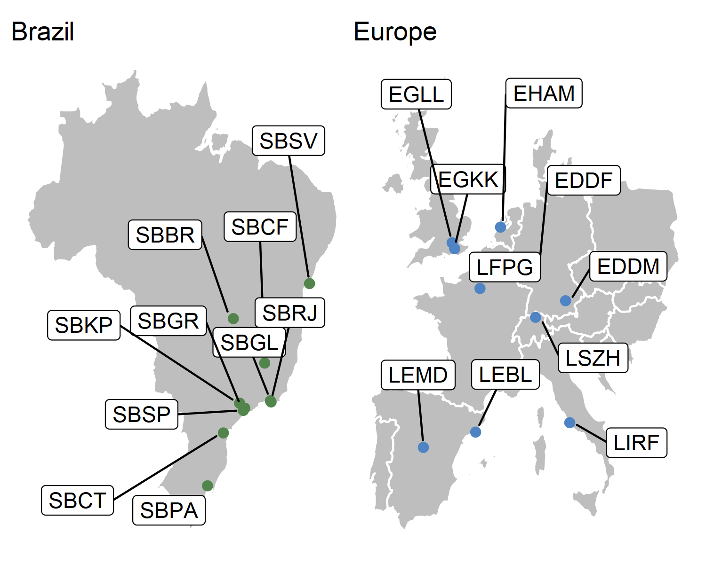
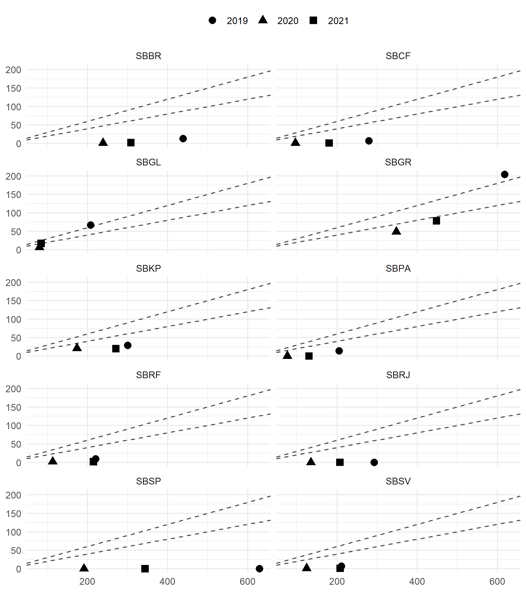
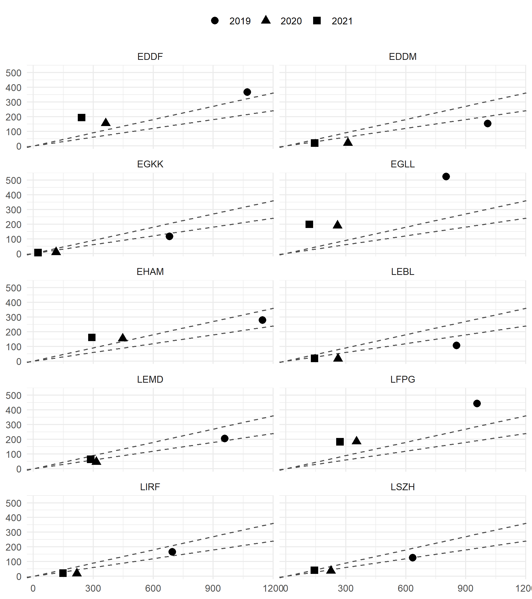

# (PART\*) Part A - Demand/Traffic Development <br> during COVID19 {#partA -}

```{r setupA, include=FALSE}
knitr::opts_chunk$set(
   echo = FALSE, message = FALSE, warning = FALSE    # messages
  , dpi = 320               #, dev.args = list(type = "cairo") #
  , dev = "ragg_png"        # works better than cairo
  , fig.retina = 2      # resolution and device
  , fig.align = "center", fig.show = "hold"          # positioning of figure
  , fig.width = 6, fig.asp = 0.618
  , out.width = "85%"                                # outside dim of figure
                      )

#Load relevant packages
library(tidyverse)
library(readr)
library(dplyr)
library(ggplot2)
library(ggrepel)
library(maps)
library(patchwork)
library(flextable)
library(lubridate)
library(zoo)

# set regional colours
bra_eur_colours <- c("#52854C","#4E84C4")

#Read relevant data
bra_count_region <- read_csv("./data/PBWG-BRA-region-traffic.csv")
eur_count_region <- read_csv("./data/PBWG-EUR-region-traffic.csv")


bra_count_airport <- read_csv("./data/PBWG-BRA-airport-traffic.csv") %>%
  mutate(APT_ICAO = as.factor(APT_ICAO))

eur_apts <- c("EGLL","EGKK","EHAM","EDDF","EDDM","LFPG","LSZH","LEMD","LEBL","LIRF")
eur_count_airport <- read_csv("./data/PBWG-EUR-airport-traffic.csv") %>% 
  mutate(APT_ICAO = as.factor(ICAO), .before = DATE, .keep = "unused") %>%
  filter(APT_ICAO %in% eur_apts) %>%
  drop_na() # removes missing data (e.g. June --> April @ LEMD)

#------------- determine max date in our data sets -------------------
## this allows to calculate the variation year-to-date
max_date_in_data <- function(.ds){
  max_date <- .ds %>% pull(DATE) %>% max()
}
bra_apt_max_date <- bra_count_airport %>% max_date_in_data()
eur_apt_max_date <- eur_count_airport %>% max_date_in_data()

DateLimit <- min(bra_apt_max_date, eur_apt_max_date)
```


\newpage

<div style='background:#f8f8f8; margin-top:150px; font-size:smaller'>

**COPYRIGHT NOTICE AND DISCLAIMER**

Every possible effort was made to ensure that the information and analysis contained in this document are as accurate and complete as possible. Should you find any errors or inconsistencies we would be grateful if you could bring them to our attention.

The views expressed herein do not necessarily reflect the official views or policy of DECEA or EUROCONTROL, which makes no warranty, either implied or express, for the information contained in this document, neither does it assume any legal liability or responsibility for the accuracy, completeness or usefulness of this information.

This document is jointly published by EUROCONTROL and DECEA for information purposes. It may be copied in whole or in part, provided that EUROCONTROL and DECEA is mentioned as the source and it is not used for commercial purposes (i.e. for financial gain). The information in this document may not be modified without prior written permission from EUROCONTROL and DECEA.

www.eurocontrol.int & www.decea.mil.br
</div>

\newpage

# Executive Summary - Covid Briefing {-}

This COVID-19 Briefing complements the initial operational comparison of air navigation system performance in Brazil and Europe jointly developed by the Brazilian Department of Airspace Control (DECEA) Performance Section and the EUROCONTROL Performance Review Unit (PRU). 
The comparison report covers the years 2016 through 2019 and focuses on the identification of similarities and difference between the 2 regional systems in terms of operational performance. 
An inclusion of the period 2020 through early 2021 would have distorted the trends and patterns identified.

This targeted briefing focusses on the air traffic development in both regions during the COVID pandemic. 
It provides an overview of the regional air traffic demand and addresses the impact of the varying air transport policies and government responses to air travel in Brazil and across Europe. 
Based on the initial comparison report, this briefing analyses demand on the regional network and local airport level. The local level represents the top-10 airports in each region

This briefing identifies a set of take-aways:

* the network and local airport level demand profile in Brazil and Europe differs significantly; 
* Brazil has observed a continual recovery and increase in air traffic throughout 2020;
* the European pattern is characterised by an initial recovery thorughout the summer months of 2020 and a succeeding decline as governments had to react to the increase in infections following the initial relaxation of travel constraints;
* Brazil is experiencing a similar wave of higher infections following the holiday season with a sharp drop in early 2021;
* traffic reduction at the Brazilian study airports is on average smaller than in Europe - this is primarily driven by the predominant national oriented traffic patterns in Brazil with only a small number of airports serving a discernible share of international traffic;
*this pattern is reversed in Europe with a traditionally high level of pan-regional and international air traffic.

Both reports are available online at https://ansperformance.eu/global/brazil/. 
This COVID Briefing and the associated online report will be updated on a regular basis establishing a first implementation of a rolling bi-regional ANS performance monitoring activity.

\newpage

# Introduction {-}

## Overview - Purpose {-}

The unprecedented impact of COVID-19 on air transportation poses challenges to the monitoring of air navigation system performance. On a regional level, varying traffic and travel policies in response to curbing the spread of COVID-19 have been applied and air traffic patterns have significantly changed. Applying the standard set of performance indicators chosen for the initial Brazil/Europe comparison report may therefore result in unanticipated trends. 

The Performance Section of DECEA and Performance Review Unit of EUROCONTROL are therefore monitoring the air traffic and air navigation system performance related developments in both regions. This briefing augments the initial comparison report which focuses on the pre-pandemic phase. It provides a basis to support the future adaptation of performance measures/indicators while ensuring a regular update. These updates will be made available in form of an online-based rolling monitoring activity and can be accessed at https://ansperformance.eu/global/brazil/.

The present edition of this briefing aims to compare the impact of the COVID-19 crisis on air traffic demand characteristics in Brazil and Europe

## Scope {-}

This briefing builds on the scope of the initial report ^[Please consult the scope section of the comparison report for a detailed description of the geographical scope and high-level system characteristics.].
Figure \@ref(fig:scope-graph) depicts the Brazilian and European region with the chosen study airports.

(ref:scope-graph) Geographical scope of the Brazil/Europe comparison.

```{r scope-graph, fig.cap="(ref:scope-graph)", out.width="90%"}

```

\newpage

# Timeline Review {-}

The COVID-19 pandemic hit all countries worldwide, but at different moments. 
In Europe, the first case was registered in January 24, 2020, in France. 
The first patient in Brazil was officially announced almost one month later in February 26, 2020. 
Beginning of March the global dimension of the spread of the infections became apparent. 
In March 11, 2020, the World Health Organization declared the crisis a “global pandemic”. 
This resulted in many governments imposing travel restrictions for both national and international traffic

## Regional Air Traffic {-}

(ref:timeline-region-mvts) Regional daily air traffic

Figure \@ref(fig:timeline-region-mvts) shows the regional traffic development in Brazil and Europe.
In non-disturbed times air traffic in Brazil shows only mild variation across the year. 
This is in contrast to the strong seasonal nature of air traffic in Europe in 2019 peaking during the summer months. 
In both regions, the unprecedented decline in air traffic occurred in the aftermath of the declaration by the WHO.

```{r timeline-region-mvts, fig.cap="(ref:timeline-region-mvts)"}
calc_total_flights <- function(.df){
  df <- .df %>% 
    mutate( MVTS         = ARRS + DEPS - ARRS_DOM
           ,MVTS_ROLLAVG = zoo::rollmean(x = MVTS, k = 7, align = "center", fill = NA)
           )
  return(df)
}

reg_bra <- bra_count_region %>% calc_total_flights %>%
  #---------------- doubled the reported data - sort of ok with report
  mutate(MVTS = 1.9 * MVTS, MVTS_ROLLAVG = 2 * MVTS_ROLLAVG)
# replaced bra regional traffic count with FR24 data ------------ 
# reg_bra <- read_csv("./data/PBWG-BRA-region-traffic-FR24.csv")
# reg_bra %>% pivot_wider(id_cols = "date_takeoff", names_from = "is_domestic", values_from = "n") %>% rename("DEPS_INTL"="FALSE", DEPS_DOM = "TRUE") %>% mutate(MVTS = 2 * DEPS_INTL + 2 * DEPS_DOM) %>% group_by(YEAR = year(date_takeoff)) %>% summarise(TOT = sum(MVTS))
# -------------- results in +/- 4000 flights per day
# -------------- 2019 annual ~ 1.5M ok with report
# -------------- where is the 8k per day idea coming from?


reg_eur <- eur_count_region %>% calc_total_flights

reg_tfc <- bind_rows(reg_bra, reg_eur) %>%
  select(REG, DATE, MVTS, MVTS_ROLLAVG) %>%
  filter(DATE <= DateLimit)

p1 <- reg_bra %>% mutate(DATE = as.Date(DATE)) %>%
  ggplot(aes(x = DATE)) +
  geom_point(aes(y = MVTS), colour = bra_eur_colours[1], alpha = 0.2, size = 0.2) +
  geom_line(aes(y = MVTS_ROLLAVG), colour = bra_eur_colours[1], size = 1) +
  scale_x_date(date_breaks = "1 year", limits = c(as.Date("2019-01-01"), DateLimit), date_labels = "%b-%Y", date_minor_breaks = "1 month") +
  theme_minimal() +
  labs( subtitle = "Brazil region - daily movements (rolling 7-day-average)"
       ,x = NULL, y = NULL) +
  theme(legend.position = "none")

p2 <- reg_eur %>% mutate(DATE = as.Date(DATE)) %>%
  ggplot(aes(x = DATE)) +
  geom_point(aes(y = MVTS), colour = bra_eur_colours[2], alpha = 0.2, size = 0.2) +
  geom_line(aes(y = MVTS_ROLLAVG), colour = bra_eur_colours[2], size = 1) +
  scale_x_date(date_breaks = "1 year", limits = c(as.Date("2019-01-01"), DateLimit), date_labels = "%b-%Y", date_minor_breaks = "1 month") +
  theme_minimal() +
  labs( subtitle = "European region - daily movements (rolling 7-day-average)"
       ,x = NULL, y = NULL) +
  theme(legend.position = "none")

p1 / p2
```

To understand the magnitude of the impact, Fig. \@ref(fig:norm-timeline) depicts the regional traffic in a normalised form. 
The reference level for the normalisation is set at the 90th percentile of traffic observed in 2019. 
The initial drop in traffic starts a few days earlier in Europe. 
This is related to the reaction of several air transport operators to limit their flights to Asia and some European states already reacting to the surge of infections and the anticipated declaration of the WHO.

(ref:norm-timeline) Normalised daily traffic in Brazil and Europe

```{r norm-timeline, fig.cap="(ref:norm-timeline)"}
ref_pct <- 0.9  # reference percentile for normalisation

reg_tfc <- reg_tfc %>% mutate(DATE = as.Date(DATE)) %>%
  group_by(REG) %>%
  mutate( MVTS_NORM = MVTS / quantile(MVTS[year(DATE)==2019], probs = ref_pct)
         ,MVTS_NORM_ROLLAVG = rollmean(MVTS_NORM, k = 7, fill = NA)
         ) %>%
  ungroup()

reg_tfc %>%
  ggplot(mapping = aes(x = DATE)) +
  geom_line(aes(y = MVTS_NORM, colour = REG), alpha = 0.2) +
  geom_line(aes(y = MVTS_NORM_ROLLAVG, colour = REG)) +
  scale_colour_manual(values = bra_eur_colours, labels = c("BRA","EUR")) +
  scale_y_continuous( expand = c(0, 0), limits = c(0, NA)
                     ,labels = scales::percent_format(accuracy = 1)) +
  scale_x_date(limits = c(as.Date("2019-01-01"), DateLimit), date_labels = "%b-%Y") +
  theme_minimal() +
  labs(x = NULL, y = NULL, colour = NULL) +
  theme(legend.position = c(0.9, 0.87))

```

The traffic declined in both regions in the order of magnitude of about 90% following the immediate drop of traffic due to the world wide air traffic restrictions. 
While the initial response to the drop shows a similar pattern, Europe has seen a higher share of traffic in June, July and August.
Traffic in Brazil grew gradually and consistently in 2020.
Europe was facing a 2nd wave of infections with the summer season and governments had to impose restrictions on the regional traffic.
In both regions the spike of seasonal Christmas and New Year's traffic is visible.
A significant change in the pattern developed with the beginning of 2021. 
With Europe seeing now a continual increase in air traffic in sync with the increasing rate of vaccinations, Brazil faces another wave and sees a distinct decline in regional air transportation.

## Study Airport Level Traffic {-}


```{r}
#defining reference percentile
ref_pct   <- 0.9

#utility function
daily_reg_count <- . %>% 
  group_by(DATE) %>% 
  summarize(MVTS = sum(ARRS, DEPS),
            MVTS_INT = sum(ARRS-ARRS_DOM, DEPS-DEPS_DOM)) %>%
  mutate(MVTS_NORM = MVTS / quantile(MVTS[year(DATE)==2019], probs = ref_pct),
         MVTS_INT_NORM = MVTS_INT / quantile(MVTS_INT[year(DATE)==2019], probs = ref_pct) )

eur_count_norm <- eur_count_airport %>% daily_reg_count() %>% mutate(REG = "EUR")
#creating eur rolling avgs
eur_count_norm <- eur_count_norm %>% mutate(MVTS_ROLLAVG = rollmean(MVTS, k = 7, fill = NA), MVTS_NORM_ROLLAVG = rollmean(MVTS_NORM, k = 7, fill = NA))

bra_count_norm <- bra_count_airport %>% daily_reg_count() %>% mutate(REG = "BRA")
#creating bra rolling avgs
bra_count_norm <- bra_count_norm %>% mutate(MVTS_ROLLAVG = rollmean(MVTS, k = 7, fill = NA), MVTS_NORM_ROLLAVG = rollmean(MVTS_NORM, k = 7, fill = NA))

counts_norm <- bind_rows(bra_count_norm, eur_count_norm)

ds4 <- counts_norm %>% 
  group_by(REG, YR = as.factor(year(DATE))) %>% 
  summarise(MVTS = sum(MVTS), MVTS_INT = sum(MVTS_INT)) %>% 
  mutate(VAR_TO_2019 = round((MVTS-MVTS[YR==2019])/MVTS[YR==2019], 2))
# ds4

# determine variation to current max date -----------------------
max_joint_date <- min(bra_apt_max_date, eur_apt_max_date)

var_ytd <- counts_norm %>%
  mutate(DAY_NBR = yday(DATE)) %>%
  filter(DATE <= max_joint_date, DAY_NBR <= yday(max_joint_date)) %>%
  group_by(REG, YR = year(DATE)) %>%
  summarise(MVTS = sum(MVTS), MVTS_INT = sum(MVTS_INT)) %>% 
  mutate(VAR_YTD_2019 = round((MVTS-MVTS[YR==2019])/MVTS[YR==2019], 2)
         ,YTD_NBR = yday(max_joint_date))
```

(ref:viz-annualvar) Movements at study airports in both regions.

```{r viz-annualvar, fig.cap="(ref:viz-annualvar)"}
g1 <- ds4 %>% ggplot() + 
  aes(x = REG, y = MVTS, fill = YR) +
  geom_col(position = position_dodge()) +
  scale_fill_brewer(palette="BuGn") +
  geom_text( aes(label = MVTS), position = position_dodge(0.9)
            ,vjust = ifelse(ds4$MVTS > 200000, 1.2, -0.8)) + 
  scale_y_continuous(labels = scales::number_format()) +
  theme_minimal() +
  labs(x = NULL, y = "Movements", fill = NULL
      # ,title = "Movements at the Study Airports in both Regions"
      ) +
  theme(legend.position = c(0.9, 0.9))

g2 <- ds4 %>% ggplot(aes(x = REG)) +
  geom_col(aes(y = VAR_TO_2019), fill = "royalblue") +
  geom_text(data = ds4[ds4$YR == 2020,], aes(y = VAR_TO_2019, label = scales::percent(VAR_TO_2019, accuracy = 1)), nudge_y = 0.1, color = "white" ) +
  theme(axis.title = element_blank(), axis.ticks.y = element_blank(), axis.text.y = element_blank()) +
  theme_minimal() +
  labs(subtitle = "Variation 2019-2020", x = NULL, y = NULL)

g1 + inset_element(g2, left = 0.02, bottom = 0.6, right = 0.4, top = 1)

#option 2
#ds4 %>% ggplot(aes(x = YR)) +
#  geom_line(aes(y = MVTS, group = REG, color = REG)) +
#  scale_y_continuous(limits = c(0, 3500000), labels = scales::label_number())
```

Figure \@ref(fig:viz-annualvar) shows the variation of air traffic across the study airports.
The decrease of traffic at the top-10 airports in Europe was about 13% higher than in Brazil when comparing the observed traffic in 2019 and 2020. 
The overall numbers are characteristic for the decline in traffic seen on the network level.
The traffic count displayed for 2021 reflects the traffic at the study airports for the first months of 2021.
This value should not be confused with the shown total annual values for 2019 and 2020.

## Daily Traffic at the Top-10 Airports {-}

When comparing the traffic development at the top-10 airports in both regions, a refined pattern emerges.
Figure \@ref(fig:timeline-apts) shows the daily movements at these airports.
The aggregated traffic at these airports in Brazil ranges just under 50% of the traffic levels observed in Europe during the winter season.
The sesonality of traffic in Europe is contrasted by the homogeneous demand levels in Brazil.
Similar levels have been observed in the first two months of 2021.

```{r}
p1 <- counts_norm %>%
  filter(DATE <= UpperLimit) %>%
  ggplot(aes(x = DATE)) +
  geom_line(aes(y = MVTS, colour = REG), alpha = 0.2, size = 0.2) +
  geom_line(aes(y = MVTS_ROLLAVG, colour = REG), size = 1) +
  theme_minimal() +
  labs(x = NULL, y = NULL, colour = NULL) +
  scale_colour_manual(values = bra_eur_colours) +
  scale_x_date(limits = c(as.Date("2019-01-01"), DateLimit), date_labels = "%b-%Y") +
  theme(legend.position = c(0.9,0.85), legend.background = element_rect(colour = "white"))

p2 <- counts_norm %>%
  filter(DATE <= UpperLimit) %>%
  ggplot(aes(x = DATE)) +
  geom_line(aes(y = MVTS_NORM, colour = REG), alpha = 0.2, size = 0.2) +
  geom_line(aes(y = MVTS_NORM_ROLLAVG, colour = REG), size = 1) +
  scale_colour_manual(values = bra_eur_colours) +
  scale_y_continuous( expand = c(0, 0), limits = c(0, NA)
                     ,labels = scales::percent_format(accuracy = 1)) +
  scale_x_date(limits = c(as.Date("2019-01-01"), DateLimit), date_labels = "%b-%Y") +
  theme_minimal() +
  labs(x = NULL, y = NULL) + 
  theme(legend.position = "none")
```

(ref:timeline-apts) Daily Traffic at Top-10 Airports in Brazil and Europe (total and 7-day-average)

```{r timeline-apts, fig.cap="(ref:timeline-apts)"}
p1 / p2
```

The normalised timeline in Figure \@ref(fig:timeline-apts) highlights a major difference between both regions.
The top-10 airports in Europe represent major national hubs with a strong share of pan-regional and international traffic. 
With the initial shutdown of flights to Asia of major airline (e.g. KLM, British Airways, Air France, and Lufthansa) and the increasing national restrictions on air travel, the drop of air traffic appeared to start earlier in Europe.
The share of airports with international traffic among the top-10 airports is smaller.
The continual and steady recovery in 2020 benefitted from the higher share of national traffic.
Viewing Brazil and Europe as regions, the wider variation and associated fragmentation of national response actions in terms of travel restrictions and lockdowns had a  stronger effect on European traffic.
The initial months of 2021 are also characterised by the on-going restrictions in Europe. 
Despite the fact that the study airports represent major hubs in different countries shows the impact of the highly restricted pan-regional traffic in Europe.
As a single country - under a single policy - Brazil observed a higher level of recovery.
The decline in the first quarter of 2021 is linked to the 2nd wave and associated traffic restrictions.

## Impact on International Traffic at Top-10 Airports {-}

```{r}
p1 <- counts_norm %>%
  filter(DATE <= UpperLimit) %>%
  ggplot(aes(x = DATE)) +
  geom_line(aes(y = MVTS_INT, colour = REG)) +
  scale_colour_manual(values = bra_eur_colours) +
  scale_x_date(date_breaks = "1 year", limits = c(as.Date("2019-01-01"), DateLimit), date_labels = "%b-%Y", date_minor_breaks = "1 month") +
  theme_minimal() +
  labs(x = NULL, y = NULL, colour = NULL) +
  theme(legend.position = c(0.9, 0.87), legend.background = element_rect(colour = "white"))


p2 <- counts_norm %>%
  filter(DATE <= UpperLimit) %>%
  ggplot(aes(x = DATE)) +
  geom_line(aes(y = MVTS_INT_NORM, colour = REG)) +
  scale_colour_manual(values = bra_eur_colours) + 
  scale_y_continuous( expand = c(0, 0), limits = c(0, NA)
                     ,labels = scales::percent_format(accuracy = 1)) +
  scale_x_date(date_breaks = "1 year", limits = c(as.Date("2019-01-01"), DateLimit), date_labels = "%b-%Y", date_minor_breaks = "1 month") +
  theme_minimal() +
  labs(x = NULL, y = NULL, colour = NULL) +
  theme(legend.position = "none")

```

(ref:timeline-apts-intl) Evolution of international traffic (total and 7-day-average)

```{r timeline-apts-intl, fig.cap="(ref:timeline-apts-intl)"}
# combined timeline plot
p1 / p2
```

Figure \@ref(fig:timeline-apts-intl) depicts the evolution of the international traffic at the top-10 airports in Brazil and Europe.
In 2019 international traffic in Brazil ranges about 5-6 times lower than in Europe.
The COVID related drop in international traffic occurred at the same time.
This shows that both regions reacted similarly to the pandemic declaration of WHO on 11. March 2020 after the numbers of people affected outside China increased by a 13-fold.
International traffic in Europe bounced to approximately 25% in the second half of 2020 and has plateaued at this level. 
In Brazil international traffic recovered slowly reaching a share of 25% compared to the 2019 refenrence level during the holiday season (Christmas 2020). 
In the first quarter of 2021 international traffic decreased as the increasing number of infections in Brazil discouraged travel.

<!--
# TODO 
1.explain the definitions of Internationl for Br and EUR
2.check the connections BR-EUR, via ANAC database
3. make an alternative graph with reduced timeline? check
-------------------------------------------------     -->

## Impact on Airport Level {-}

```{r}
#-----TO DO: AIRPORT BREAKDOWN
#utility function
annual_count <- . %>% group_by(APT_ICAO, YR = year(DATE)) %>% summarise(MVTS = sum(ARRS, DEPS), MVTS_INT = sum(ARRS - ARRS_DOM, DEPS - DEPS_DOM))

multiple_counts <- . %>% mutate(INT_SHARE = round(MVTS_INT / MVTS, 2), VAR_TO_2019 = round((MVTS-MVTS[YR==2019])/MVTS[YR==2019], 2))

ds1 <- eur_count_airport %>% annual_count() %>% multiple_counts() %>% mutate(REG = "EUR")
ds2 <- bra_count_airport %>% annual_count() %>% multiple_counts() %>% mutate(REG = "BRA")
ds3 <- bind_rows(ds1, ds2)

# to-do ... BRA ds3 has 12 airports
ds3 <- ds3 %>% filter(!APT_ICAO %in% c("SBFL","SBCT") )
```

(ref:apt-tfc-counts) Movements at top-10 airports in Brazil and Europe

```{r apt-tfc-counts, fig.cap="(ref:apt-tfc-counts)"}
ds3 %>% ggplot(aes(x = reorder(APT_ICAO, MVTS))) +
  geom_col(aes(y = MVTS, fill = factor(YR)), position = "dodge") +
  scale_fill_brewer(palette="BuGn", guide = guide_legend()) +
  scale_y_continuous(labels = scales::label_number()) +
  facet_grid(.~REG, scales = "free_x") +
  labs(x = NULL, y = "Movements", fill = NULL
       ,caption = "Note: 2019 and 2020: annual totals; 2021: year-to-date") +
  theme_minimal() +
  theme(axis.text.x = element_text(angle = 90, vjust = 0.5), axis.ticks = element_blank()) +
  theme(legend.position = "top")
```

Figure \@ref(fig:apt-tfc-counts) depicts the annual traffic for 2019 and 2020.
The traffic for 2021 is shown on a year-to-date basis.
While the overall traffic levels at the Brazilian top-10 is on average lower than the traffic at European airports, the aforementioned phenomena can now be identified on an airport-by-airport basis.
In 2019, Guarulhos (SBGR) and São Paulo (SBSP) have shown traffic levels comparable with London Gatwick (EGKK), Zurich (LSZH), or Rome Fiumicino (LIRF).
However, the annual traffic in 2020 exceeds in the case of SBGR and ranges at the same level for SBSP of the comparator airports in Europe. 
THis shows the effect of the drop in pan-regional traffic in Europe.
On average, the annual traffic declined less in Brazil than at the European top-10.
This difference in variation of the annual traffic has been already reported above, c.f. \@ref(fig:viz-annualvar).

(ref:apt-annual-var-2020) Annual variation of traffic at top-10 airports in Brazil and Europe

```{r apt-annual-var-2020, fig.cap="(ref:apt-annual-var-2020)"}
ds3 %>% filter(YR == 2020) %>%
  ggplot(aes(x = reorder(APT_ICAO, VAR_TO_2019))) +
  geom_col(aes(y = VAR_TO_2019, fill = REG)) +
  scale_fill_manual(values = bra_eur_colours) +
  geom_text( aes(y = VAR_TO_2019, label = scales::percent(VAR_TO_2019, accuracy = 1))
            , size = 3, nudge_y = 0.05
            , colour = "white") +
  scale_y_continuous(labels = scales::percent_format(), limits = c(-0.8,0)) +
  coord_flip() +
  labs(caption = "Variation of annual traffic 2019-2020"
    ,y = NULL, x = NULL, fill = NULL) +
  theme_minimal() +
  theme(legend.position = c(0.1, 0.875), legend.background = element_rect(color = "white"))
```

(ref:apt-annual-var-2021) Year-to-date variation of traffic at top-10 airports in Brazil and Europe

```{r apt-annual-var-2021, fig.cap="(ref:apt-annual-var-2021)"}
apt_count <- bind_rows( bra_count_airport %>% mutate(REG = "BRA") %>% filter(!APT_ICAO %in% c("SBFL","SBCT") )
                       ,eur_count_airport %>% mutate(REG = "EUR")
                       ) %>% 
  mutate(DAY_NBR = yday(DATE))

ytd_apt_var <- apt_count %>% 
  filter( year(DATE) %in% c(2019, 2021)
         ,DAY_NBR    <=   yday(max_joint_date)
         ) %>%
  group_by(APT_ICAO, YEAR = year(DATE)) %>%
  summarise(REG = unique(REG), DAYS = n(), MVTS = sum(ARRS) + sum(DEPS), .groups = "drop") %>%
  mutate(VAR_YTD = ifelse(YEAR == 2021, - round( 1 - (MVTS / lag(MVTS)),2), NA)
         )

ytd_apt_var %>% filter(YEAR == 2021) %>%
  ggplot(  aes(x = reorder(APT_ICAO, VAR_YTD))) +
  geom_col(aes(y = VAR_YTD, fill = REG)) +
  coord_flip() +
  scale_fill_manual(values = bra_eur_colours) +
  geom_text( aes(y = VAR_YTD, label = scales::percent(VAR_YTD, accuracy = 1))
            , size = 3, nudge_y = 0.05
            , colour = "white") +
 scale_y_continuous(labels = scales::percent_format()
                    , limits = c(-0.99,0)
                    ) +
  labs(caption = "Variation of year-to-date traffic 2019 vs 2021"
    ,y = NULL, x = NULL, fill = NULL) +
  theme_minimal() +
  theme(legend.position = c(0.1, 0.875), legend.background = element_rect(color = "white"))
```

Figure \@ref(fig:apt-annual-var-2020) shows the variation of the annual traffic at the top-10 airports in each region.
The ordering shows that on average European airports have seen a higher share of air traffic reduction than the top-10 in Brazil. 
The beginning of 2021, c.f. \@ref(fig:apt-annual-var-2021), shows a higher level of traffic recovery at the top-10 airports in Brazil.
This recovery needs to be balanced across the overall trend showing a new wave decline, c.f. \@ref(fig:timeline-apts).
With a discernible recovery in Europe the dire overall year-to-date results are expected to improve.

<!--| connectivity: 
 - can we develop a map showing traffic flows? 
    Picture arrow from Brazil to CAM, NAM, AsiaPacific, Europe?
 - from our source data we should be able to develop a scatter plot showing
   number of international vs domestic/regional connections for the study airports.
 - we could produce a map/chart as facet for 2019, 2020, and YTD2021
-->

```{r}
tmp <- apt_count %>% 
  group_by(APT_ICAO, REG, YEAR = year(DATE)) %>% 
  summarise( MVTS_DOM  = median(ARRS_DOM + DEPS_DOM)
            ,MVTS_INTL = median(ARRS - ARRS_DOM + DEPS - DEPS_DOM))

tmp_bra <- tmp %>% filter(REG == "BRA")
tmp_eur <- tmp %>% filter(REG == "EUR")
```

(ref:dom-intl-bra) Brazil - share of international over domestic traffic

```{r dom-intl-bra, fig.cap="(ref:dom-intl-bra)"}
pp <- tmp_bra %>% 
  ggplot() + 
  geom_abline(intercept = 0, slope = 0.3, linetype = "dashed", colour = "grey30") +
  geom_abline(intercept = 0, slope = 0.2, linetype = "dashed", colour = "grey30") +
  geom_point(aes(x = MVTS_DOM, y = MVTS_INTL, shape = as.factor(YEAR)), size = 3) +
  labs(x = NULL, y = NULL, shape = NULL) +
  theme_minimal() +
  facet_wrap(. ~ APT_ICAO, ncol = 2) +
  theme(legend.position = "top")
ggsave("./figures/mvt-dom-intl-bra.png", height = 20, units = "cm")

```

(ref:dom-intl-eur) Europe - share of international over domestic traffic

```{r dom-intl-eur, fig.cap="(ref:dom-intl-eur)"}
pp <- tmp_eur %>% 
  ggplot() + 
  geom_abline(intercept = 0, slope = 0.3, linetype = "dashed", colour = "grey30") +
  geom_abline(intercept = 0, slope = 0.2, linetype = "dashed", colour = "grey30") +
  geom_point(aes(x = MVTS_DOM, y = MVTS_INTL, shape = as.factor(YEAR)), size = 3) +
  labs(x = NULL, y = NULL, shape = NULL) +
  theme_minimal() +
  facet_wrap(. ~ APT_ICAO, ncol = 2) +
  theme(legend.position = "top")
ggsave("./figures/mvt-dom-intl-eur.png", height = 20, units = "cm")

```

Figure \@ref(fig:dom-intl-bra) and Fig. \@ref(fig:dom-intl-eur) show the relationship between the annual median number of international over domestic flights for the top-10 airport in both regions.
The observed traffic at all airports shows the contracting behaviour when comparing the share of international and regional flights. 
As presented above, the majority of Brazilian airports in this study serve predominantly regional (domestic) traffic.
SBGL and SBGR are the 2 airports of the Brazilian top-10 that observe a share of international traffic ranging around 30% with a clear contraction when comparing 2019 with 2020 and 2021.
The role of SBSP as a national hub and negligible international traffic is prominent.The other airports sit below the 20% composition.
For Amsterdam (EHAM), Frankfurt (EDDF), and London Heathrow (EGLL) the ratio of international vs regional (domestic and pan-European) flights ranges in all years above the 30%.
The nature of the European network is shown in Fig. \@ref(fig:dom-intl-eur). The majority of the European top-10 airports observe a share of international flights ranging between 20-30% of the total traffic.
The overall traffic decline in 2020 and in the beginning of 2021 can be seen in the contraction towards the origin with a typical higher loss of international traffic.
On average, European airports serve a higher number of international traffic. This is linked to the wide-spread market of national hubs and flag carriers. This also shows that Europe is more susceptible to international and regional travel contraints.
The high share of international (non-European traffic) at London Heathrow (EGLL), Amsterdam (EHAM), and frankfurt (EDDF) evidences further what role these major hubs play within the European network. 

\newpage

# Conclusion {-}

This COVID-19 Briefing complements the initial operational ANS performance comparison between Brazil and Europe focussing on the air traffic development throughout 2020 and early 2021.
This report serves as a nucleus for a regular updated online report in support of a future edition of the bi-regional comparison. 

The June-2021 edition shows a varied picture for the evolution of air traffic demand in both regions.
The higher level of fragmentation within the European context can be seen on the regional network and local (airport) level.
Air traffic in Brazil benefitted from the existence of a unified set of travel contraints and the focus of international traffic on a subset of the top-10 airports.
In Europe, the share of international and pan-regional connections per airport is higher. Accordingly, the variations across different national approaches to contain the spread of COVID-19 and associated travel constraint had an overall impact on the European network.
Despite the initial recovery in summer 2020 was countered by a withdrawal of the freedoms due to increasing infection rates across Europe and delayed launches of vaccination programmes. A discernible increase in air traffic is seen with the second quarter of 2021.
Brazil observed a continual recovery in 2020 driven. However, the increase in infection rates resulted in a strong decline in early 2021.

The strategic perspective on the recovery of air traffic around the globe varies. 
This edition shows a different pattern in Brazil and Europe that can help to further study pandemic related phenomena.
With the returning traffic, the focus can move again to addressing how the systems cope with the increasing air traffic.
It is planned to develop the regular update of this briefing into the next iteration of the Brazil/Europe comparison report.

For the latest edition, please consult https://ansperformance.eu/global/brazil/.
