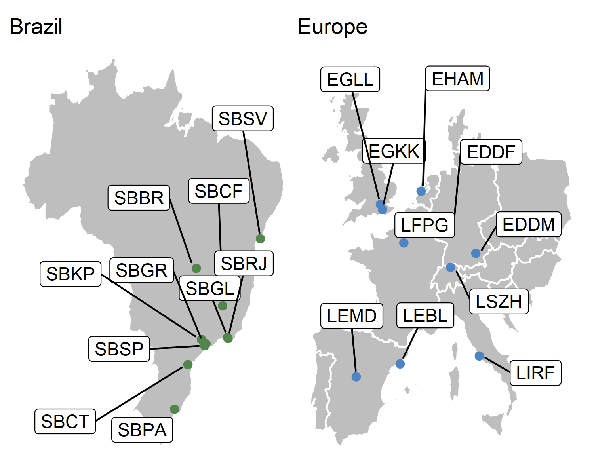
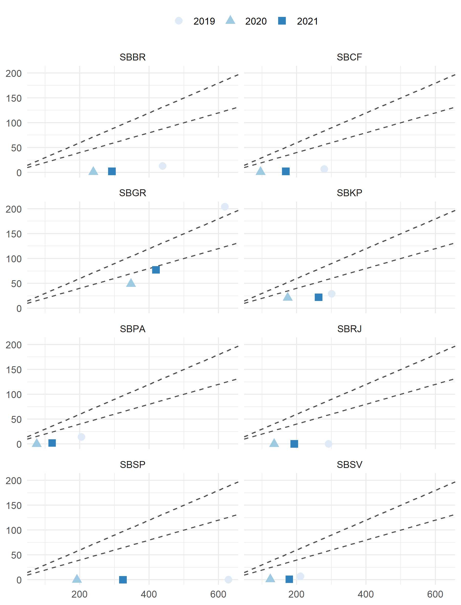
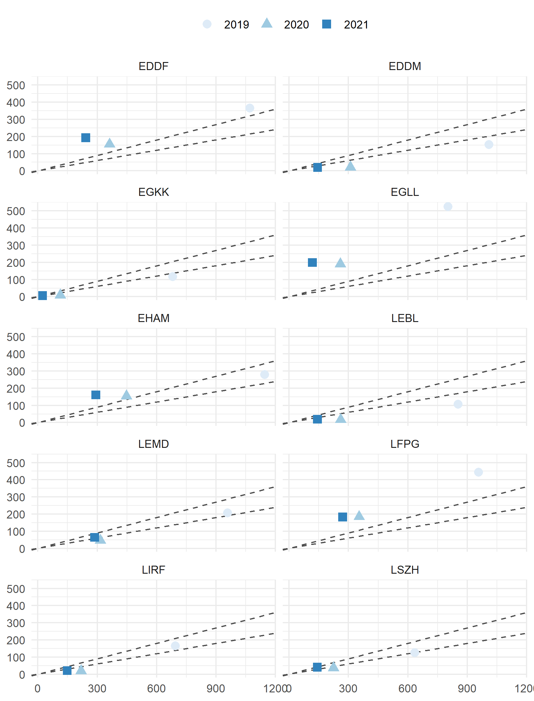
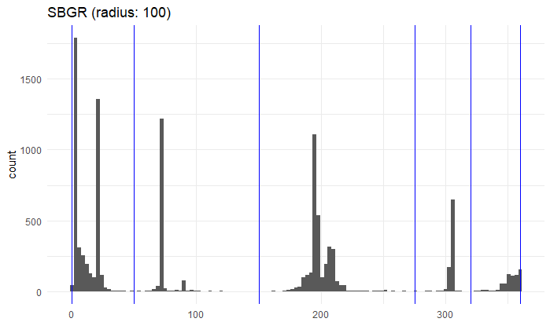

--- 
title: "Comparison of Operational Air Navigation System Performance in Brazil and Europe"
author: "Performance Section (DECEA) and Performance Review Unit (EUROCONTROL)"
date: "`r format(Sys.Date(),'%d %B %Y')`"
site: bookdown::bookdown_site
output: bookdown::gitbook
documentclass: book
bibliography: [book.bib, packages.bib, Brazil-Europe-Comparison-xbib.bib]
biblio-style: apalike
link-citations: yes
github-repo: euctrl-pru/international-BRA-EUR
description: "This initial comparison of Operational Air Navigation System Performance in Brazil and Europe is a jointly developed report. It comprises two parts: Part A provides the most recent traffic/demand related system characterisation in light of COVID19; Part B represents the initial comparison report based on a selected subset of measures. The regional comparison will be updated on a regular basis."
---

```{r include=FALSE}
# automatically create a bib database for R packages
knitr::write_bib(c(
  .packages(), 'bookdown', 'knitr', 'rmarkdown'
), 'packages.bib')
# set knitroptions
knitr::opts_chunk$set(echo = FALSE, message = FALSE, warning = FALSE)
```

# Welcome {-}

<!-- banner for top of the page ------------------------------------------  
bookdown formt strips off js before first heading! -----------------------   -->
```{js, echo = FALSE}
title=document.getElementById('header');
title.innerHTML = '' + title.innerHTML
```


This online version presents the initial comparison of Operational Air Navigation System Performance in Brazil and Europe.

<div style="float:right; padding:10px; height:150px; width:100px">
<a href="Brazil-Europe-COVID19-Briefing-20210708.pdf">download briefing
```{r cover-briefing, echo=FALSE}
knitr::include_graphics("figures/x-cover-bra-eur-2019.png")
```
</a>
</div>

It is organised in 2 parts:

* **Part A - COVID-Briefing**: A most recent COVID19 related descriptoin of the regional system characteristics in terms of traffic/demand evolution. The reporting will be augmented over time with operational performance measures reflecting the changes in both regions.    
This part will be updated on a regular basis.

<div style="float:right; padding:10px; height:150px; width:100px">
<a href="Brazil-Europe-Comparison-Report-20210708.pdf" download>download report
```{r cover2019, echo=FALSE}
knitr::include_graphics("figures/x-cover-bra-eur-2019.png")
```
</a>
</div>

* **Part B - initial comparison report**: The initial comparison report describes the operational performance in Brazil and Europe for the years 2016-2019. It is based on a selected subset of the ICAO GANP key performance indicators. It is planned that the rolling update of Part A will successively develop into the next iteration of the comparison report.

Previous reports will be available via this page for download.

For any questions, please do not hesitate to contact one of the authoring organisations.
Enjoy the read!

*Performance Section, DECEA*    
*Performance Review Unit, EUROCONTROL*


<!--chapter:end:index.Rmd-->

# (PART\*) Part A - Demand/Traffic Development <br> during COVID19 {#partA -}

```{r setupA, include=FALSE}
knitr::opts_chunk$set(
   echo = FALSE, message = FALSE, warning = FALSE    # messages
  , dpi = 320               #, dev.args = list(type = "cairo") #
  , dev = "ragg_png"        # works better than cairo
  , fig.retina = 2      # resolution and device
  , fig.align = "center", fig.show = "hold"          # positioning of figure
  , fig.width = 6, fig.asp = 0.618
  , out.width = "85%"                                # outside dim of figure
                      )

#Load relevant packages
library(tidyverse)
library(readr)
library(dplyr)
library(ggplot2)
library(ggrepel)
library(maps)
library(patchwork)
library(flextable)
library(lubridate)
library(zoo)

# set regional colours
bra_eur_colours <- c("#52854C","#4E84C4")

#Read relevant data
bra_count_region <- read_csv("./data/BRA-region-traffic.csv")
eur_count_region <- read_csv("./data/PBWG-EUR-region-traffic.csv")


bra_count_airport <- read_csv("./data/BRA-airport-traffic.csv") %>%
  mutate(APT_ICAO = as.factor(APT_ICAO))

eur_apts <- c("EGLL","EGKK","EHAM","EDDF","EDDM","LFPG","LSZH","LEMD","LEBL","LIRF")
eur_count_airport <- read_csv("./data/PBWG-EUR-airport-traffic.csv") %>% 
  mutate(APT_ICAO = as.factor(ICAO), .before = DATE, .keep = "unused") %>%
  filter(APT_ICAO %in% eur_apts) %>%
  drop_na() # removes missing data (e.g. June --> April @ LEMD)

#------------- determine max date in our data sets -------------------
## this allows to calculate the variation year-to-date
max_date_in_data <- function(.ds){
  max_date <- .ds %>% pull(DATE) %>% max()
}
bra_apt_max_date <- bra_count_airport %>% max_date_in_data()
eur_apt_max_date <- eur_count_airport %>% max_date_in_data()

DateLimit <- min(bra_apt_max_date, eur_apt_max_date)
```


\newpage

<div style='background:#f8f8f8; margin-top:150px; font-size:smaller'>

**COPYRIGHT NOTICE AND DISCLAIMER**

Every possible effort was made to ensure that the information and analysis contained in this document are as accurate and complete as possible. Should you find any errors or inconsistencies we would be grateful if you could bring them to our attention.

The views expressed herein do not necessarily reflect the official views or policy of DECEA or EUROCONTROL, which makes no warranty, either implied or express, for the information contained in this document, neither does it assume any legal liability or responsibility for the accuracy, completeness or usefulness of this information.

This document is jointly published by EUROCONTROL and DECEA for information purposes. It may be copied in whole or in part, provided that EUROCONTROL and DECEA is mentioned as the source and it is not used for commercial purposes (i.e. for financial gain). The information in this document may not be modified without prior written permission from EUROCONTROL and DECEA.

www.eurocontrol.int & www.decea.mil.br
</div>

\newpage

# Executive Summary - Covid Briefing {-}

This COVID-19 Briefing complements the initial operational comparison of air navigation system performance in Brazil and Europe jointly developed by the Brazilian Department of Airspace Control (DECEA) Performance Section and the EUROCONTROL Performance Review Unit (PRU). 
The comparison report covers the years 2016 through 2019 and focuses on the identification of similarities and difference between the 2 regional systems in terms of operational performance. 
An inclusion of the period 2020 through early 2021 would have distorted the trends and patterns identified.

This targeted briefing focusses on the air traffic development in both regions during the COVID pandemic. 
It provides an overview of the regional air traffic demand and addresses the impact of the varying air transport policies and government responses to air travel in Brazil and across Europe. 
Based on the initial comparison report, this briefing analyses demand on the regional network and local airport level. The local level represents the top-10 airports in each region

This briefing identifies a set of take-aways:

* the network and local airport level demand profile in Brazil and Europe differs significantly; 
* Brazil has observed a continual recovery and increase in air traffic throughout 2020;
* the European pattern is characterised by an initial recovery thorughout the summer months of 2020 and a succeeding decline as governments had to react to the increase in infections following the initial relaxation of travel constraints;
* Brazil is experiencing a similar wave of higher infections following the holiday season with a sharp drop in early 2021;
* traffic reduction at the Brazilian study airports is on average smaller than in Europe - this is primarily driven by the predominant national oriented traffic patterns in Brazil with only a small number of airports serving a discernible share of international traffic;
*this pattern is reversed in Europe with a traditionally high level of pan-regional and international air traffic.

Both reports are available online at https://ansperformance.eu/global/brazil/. 
This COVID Briefing and the associated online report will be updated on a regular basis establishing a first implementation of a rolling bi-regional ANS performance monitoring activity.

\newpage

# Introduction {-}

## Overview - Purpose {-}

The unprecedented impact of COVID-19 on air transportation poses challenges to the monitoring of air navigation system performance. On a regional level, varying traffic and travel policies in response to curbing the spread of COVID-19 have been applied and air traffic patterns have significantly changed. Applying the standard set of performance indicators chosen for the initial Brazil/Europe comparison report may therefore result in unanticipated trends. 

The Performance Section of DECEA and Performance Review Unit of EUROCONTROL are therefore monitoring the air traffic and air navigation system performance related developments in both regions. This briefing augments the initial comparison report which focuses on the pre-pandemic phase. It provides a basis to support the future adaptation of performance measures/indicators while ensuring a regular update. These updates will be made available in form of an online-based rolling monitoring activity and can be accessed at https://ansperformance.eu/global/brazil/.

The present edition of this briefing aims to compare the impact of the COVID-19 crisis on air traffic demand characteristics in Brazil and Europe

## Scope {-}

This briefing builds on the scope of the initial report ^[Please consult the scope section of the comparison report for a detailed description of the geographical scope and high-level system characteristics.].
Figure \@ref(fig:scope-graph) depicts the Brazilian and European region with the chosen study airports.

(ref:scope-graph) Geographical scope of the Brazil/Europe comparison.

```{r scope-graph, fig.cap="(ref:scope-graph)", out.width="90%"}

```

\newpage

# Traffic Characterization {-}

The COVID-19 pandemic hit all countries worldwide, but at different moments. 
In Europe, the first case was registered in January 24, 2020, in France. 
The first patient in Brazil was officially announced almost one month later in February 26, 2020. 
Beginning of March the global dimension of the spread of the infections became apparent. 
In March 11, 2020, the World Health Organization declared the crisis a “global pandemic”. 
This resulted in many governments imposing travel restrictions for both national and international traffic

## Regional Air Traffic {-}

(ref:timeline-region-mvts) Regional daily air traffic

Figure \@ref(fig:timeline-region-mvts) shows the regional traffic development in Brazil and Europe.
In non-disturbed times air traffic in Brazil shows only mild variation across the year. 
This is in contrast to the strong seasonal nature of air traffic in Europe in 2019 peaking during the summer months. 
In both regions, the unprecedented decline in air traffic occurred in the aftermath of the declaration by the WHO.

```{r timeline-region-mvts, fig.cap="(ref:timeline-region-mvts)"}
calc_total_flights <- function(.df){
  df <- .df %>% 
    mutate( MVTS         = ARRS + DEPS - ARRS_DOM
           ,MVTS_ROLLAVG = zoo::rollmean(x = MVTS, k = 7, align = "center", fill = NA)
           )
  return(df)
}

reg_bra <- bra_count_region %>% calc_total_flights %>%
  #---------------- doubled the reported data - sort of ok with report
  mutate(MVTS = 1.9 * MVTS, MVTS_ROLLAVG = 2 * MVTS_ROLLAVG)
# replaced bra regional traffic count with FR24 data ------------ 
# reg_bra <- read_csv("./data/PBWG-BRA-region-traffic-FR24.csv")
# reg_bra %>% pivot_wider(id_cols = "date_takeoff", names_from = "is_domestic", values_from = "n") %>% rename("DEPS_INTL"="FALSE", DEPS_DOM = "TRUE") %>% mutate(MVTS = 2 * DEPS_INTL + 2 * DEPS_DOM) %>% group_by(YEAR = year(date_takeoff)) %>% summarise(TOT = sum(MVTS))
# -------------- results in +/- 4000 flights per day
# -------------- 2019 annual ~ 1.5M ok with report
# -------------- where is the 8k per day idea coming from?


reg_eur <- eur_count_region %>% calc_total_flights

reg_tfc <- bind_rows(reg_bra, reg_eur) %>%
  select(REG, DATE, MVTS, MVTS_ROLLAVG) %>%
  filter(DATE <= DateLimit)

p1 <- reg_bra %>% mutate(DATE = as.Date(DATE)) %>%
  ggplot(aes(x = DATE)) +
  geom_point(aes(y = MVTS), colour = bra_eur_colours[1], alpha = 0.2, size = 0.2) +
  geom_line(aes(y = MVTS_ROLLAVG), colour = bra_eur_colours[1], size = 1) +
  scale_x_date(date_breaks = "1 year", limits = c(as.Date("2019-01-01"), DateLimit), date_labels = "%b-%Y", date_minor_breaks = "1 month") +
  theme_minimal() +
  labs( subtitle = "Brazil region - daily movements (rolling 7-day-average)"
       ,x = NULL, y = NULL) +
  theme(legend.position = "none")

p2 <- reg_eur %>% mutate(DATE = as.Date(DATE)) %>%
  ggplot(aes(x = DATE)) +
  geom_point(aes(y = MVTS), colour = bra_eur_colours[2], alpha = 0.2, size = 0.2) +
  geom_line(aes(y = MVTS_ROLLAVG), colour = bra_eur_colours[2], size = 1) +
  scale_x_date(date_breaks = "1 year", limits = c(as.Date("2019-01-01"), DateLimit), date_labels = "%b-%Y", date_minor_breaks = "1 month") +
  theme_minimal() +
  labs( subtitle = "European region - daily movements (rolling 7-day-average)"
       ,x = NULL, y = NULL) +
  theme(legend.position = "none")

p1 / p2
```

To understand the magnitude of the impact, Fig. \@ref(fig:norm-timeline) depicts the regional traffic in a normalised form. 
The reference level for the normalisation is set at the 90th percentile of traffic observed in 2019. 
The initial drop in traffic starts a few days earlier in Europe. 
This is related to the reaction of several air transport operators to limit their flights to Asia and some European states already reacting to the surge of infections and the anticipated declaration of the WHO.

(ref:norm-timeline) Normalised daily traffic in Brazil and Europe

```{r norm-timeline, fig.cap="(ref:norm-timeline)"}
ref_pct <- 0.9  # reference percentile for normalisation

reg_tfc <- reg_tfc %>% mutate(DATE = as.Date(DATE)) %>%
  group_by(REG) %>%
  mutate( MVTS_NORM = MVTS / quantile(MVTS[year(DATE)==2019], probs = ref_pct)
         ,MVTS_NORM_ROLLAVG = rollmean(MVTS_NORM, k = 7, fill = NA)
         ) %>%
  ungroup()

reg_tfc %>%
  ggplot(mapping = aes(x = DATE)) +
  geom_line(aes(y = MVTS_NORM, colour = REG), alpha = 0.2) +
  geom_line(aes(y = MVTS_NORM_ROLLAVG, colour = REG)) +
  scale_colour_manual(values = bra_eur_colours, labels = c("BRA","EUR")) +
  scale_y_continuous( expand = c(0, 0), limits = c(0, NA)
                     ,labels = scales::percent_format(accuracy = 1)) +
  scale_x_date(limits = c(as.Date("2019-01-01"), DateLimit), date_labels = "%b-%Y") +
  theme_minimal() +
  labs(x = NULL, y = NULL, colour = NULL) +
  theme(legend.position = c(0.9, 0.87))

```

The traffic declined in both regions in the order of magnitude of about 90% following the immediate drop of traffic due to the world wide air traffic restrictions. 
While the initial response to the drop shows a similar pattern, Europe has seen a higher share of traffic in June, July and August.
Traffic in Brazil grew gradually and consistently in 2020.
Europe was facing a 2nd wave of infections with the summer season and governments had to impose restrictions on the regional traffic.
In both regions the spike of seasonal Christmas and New Year's traffic is visible.
A significant change in the pattern developed with the beginning of 2021. 
With Europe seeing now a continual increase in air traffic in sync with the increasing rate of vaccinations, Brazil faces another wave and sees a distinct decline in regional air transportation.

## Study Airport Level Traffic {-}


```{r}
#defining reference percentile
ref_pct   <- 0.9

#utility function
daily_reg_count <- . %>% 
  group_by(DATE) %>% 
  summarize(MVTS = sum(ARRS, DEPS),
            MVTS_INT = sum(ARRS-ARRS_DOM, DEPS-DEPS_DOM)) %>%
  mutate(MVTS_NORM = MVTS / quantile(MVTS[year(DATE)==2019], probs = ref_pct),
         MVTS_INT_NORM = MVTS_INT / quantile(MVTS_INT[year(DATE)==2019], probs = ref_pct) )

eur_count_norm <- eur_count_airport %>% daily_reg_count() %>% mutate(REG = "EUR")
#creating eur rolling avgs
eur_count_norm <- eur_count_norm %>% mutate(MVTS_ROLLAVG = rollmean(MVTS, k = 7, fill = NA), MVTS_NORM_ROLLAVG = rollmean(MVTS_NORM, k = 7, fill = NA))

bra_count_norm <- bra_count_airport %>% daily_reg_count() %>% mutate(REG = "BRA")
#creating bra rolling avgs
bra_count_norm <- bra_count_norm %>% mutate(MVTS_ROLLAVG = rollmean(MVTS, k = 7, fill = NA), MVTS_NORM_ROLLAVG = rollmean(MVTS_NORM, k = 7, fill = NA))

counts_norm <- bind_rows(bra_count_norm, eur_count_norm)

ds4 <- counts_norm %>% 
  group_by(REG, YR = as.factor(year(DATE))) %>% 
  summarise(MVTS = sum(MVTS), MVTS_INT = sum(MVTS_INT)) %>% 
  mutate(VAR_TO_2019 = round((MVTS-MVTS[YR==2019])/MVTS[YR==2019], 2))
# ds4

# determine variation to current max date -----------------------
max_joint_date <- min(bra_apt_max_date, eur_apt_max_date)

var_ytd <- counts_norm %>%
  mutate(DAY_NBR = yday(DATE)) %>%
  filter(DATE <= max_joint_date, DAY_NBR <= yday(max_joint_date)) %>%
  group_by(REG, YR = year(DATE)) %>%
  summarise(MVTS = sum(MVTS), MVTS_INT = sum(MVTS_INT)) %>% 
  mutate(VAR_YTD_2019 = round((MVTS-MVTS[YR==2019])/MVTS[YR==2019], 2)
         ,YTD_NBR = yday(max_joint_date))
```

(ref:viz-annualvar) Movements at study airports in both regions.

```{r viz-annualvar, fig.cap="(ref:viz-annualvar)"}
g1 <- ds4 %>% ggplot() + 
  aes(x = REG, y = MVTS, fill = YR) +
  geom_col(position = position_dodge()) +
  scale_fill_brewer(palette="BuGn") +
  geom_text( aes(label = MVTS), position = position_dodge(0.9)
            ,vjust = ifelse(ds4$MVTS > 200000, 1.2, -0.8)) + 
  scale_y_continuous(labels = scales::number_format()) +
  theme_minimal() +
  labs(x = NULL, y = "Movements", fill = NULL
      # ,title = "Movements at the Study Airports in both Regions"
      ) +
  theme(legend.position = c(0.9, 0.9))

g2 <- ds4 %>% ggplot(aes(x = REG)) +
  geom_col(aes(y = VAR_TO_2019), fill = "royalblue") +
  geom_text(data = ds4[ds4$YR == 2020,], aes(y = VAR_TO_2019, label = scales::percent(VAR_TO_2019, accuracy = 1)), nudge_y = 0.1, color = "white" ) +
  theme(axis.title = element_blank(), axis.ticks.y = element_blank(), axis.text.y = element_blank()) +
  theme_minimal() +
  labs(subtitle = "Variation 2019-2020", x = NULL, y = NULL)

g1 + inset_element(g2, left = 0.02, bottom = 0.6, right = 0.4, top = 1)

#option 2
#ds4 %>% ggplot(aes(x = YR)) +
#  geom_line(aes(y = MVTS, group = REG, color = REG)) +
#  scale_y_continuous(limits = c(0, 3500000), labels = scales::label_number())
```

Figure \@ref(fig:viz-annualvar) shows the variation of air traffic across the study airports.
The decrease of traffic at the top-10 airports in Europe was about 13% higher than in Brazil when comparing the observed traffic in 2019 and 2020. 
The overall numbers are characteristic for the decline in traffic seen on the network level.
The traffic count displayed for 2021 reflects the traffic at the study airports for the first months of 2021.
This value should not be confused with the shown total annual values for 2019 and 2020.

## Daily Traffic at the Top-10 Airports {-}

When comparing the traffic development at the top-10 airports in both regions, a refined pattern emerges.
Figure \@ref(fig:timeline-apts) shows the daily movements at these airports.
The aggregated traffic at these airports in Brazil ranges just under 50% of the traffic levels observed in Europe during the winter season.
The sesonality of traffic in Europe is contrasted by the homogeneous demand levels in Brazil.
Similar levels have been observed in the first two months of 2021.

```{r}
UpperLimit <- as.Date("20200-01-01")

p1 <- counts_norm %>%
  filter(DATE <= UpperLimit) %>%
  ggplot(aes(x = DATE)) +
  geom_line(aes(y = MVTS, colour = REG), alpha = 0.2, size = 0.2) +
  geom_line(aes(y = MVTS_ROLLAVG, colour = REG), size = 1) +
  theme_minimal() +
  labs(x = NULL, y = NULL, colour = NULL) +
  scale_colour_manual(values = bra_eur_colours) +
  scale_x_date(limits = c(as.Date("2019-01-01"), DateLimit), date_labels = "%b-%Y") +
  theme(legend.position = c(0.9,0.85), legend.background = element_rect(colour = "white"))

p2 <- counts_norm %>%
  filter(DATE <= UpperLimit) %>%
  ggplot(aes(x = DATE)) +
  geom_line(aes(y = MVTS_NORM, colour = REG), alpha = 0.2, size = 0.2) +
  geom_line(aes(y = MVTS_NORM_ROLLAVG, colour = REG), size = 1) +
  scale_colour_manual(values = bra_eur_colours) +
  scale_y_continuous( expand = c(0, 0), limits = c(0, NA)
                     ,labels = scales::percent_format(accuracy = 1)) +
  scale_x_date(limits = c(as.Date("2019-01-01"), DateLimit), date_labels = "%b-%Y") +
  theme_minimal() +
  labs(x = NULL, y = NULL) + 
  theme(legend.position = "none")
```

(ref:timeline-apts) Daily Traffic at Top-10 Airports in Brazil and Europe (total and 7-day-average)

```{r timeline-apts, fig.cap="(ref:timeline-apts)"}
p1 / p2
```

The normalised timeline in Figure \@ref(fig:timeline-apts) highlights a major difference between both regions.
The top-10 airports in Europe represent major national hubs with a strong share of pan-regional and international traffic. 
With the initial shutdown of flights to Asia of major airline (e.g. KLM, British Airways, Air France, and Lufthansa) and the increasing national restrictions on air travel, the drop of air traffic appeared to start earlier in Europe.
The share of airports with international traffic among the top-10 airports is smaller.
The continual and steady recovery in 2020 benefitted from the higher share of national traffic.
Viewing Brazil and Europe as regions, the wider variation and associated fragmentation of national response actions in terms of travel restrictions and lockdowns had a  stronger effect on European traffic.
The initial months of 2021 are also characterised by the on-going restrictions in Europe. 
Despite the fact that the study airports represent major hubs in different countries shows the impact of the highly restricted pan-regional traffic in Europe.
As a single country - under a single policy - Brazil observed a higher level of recovery.
The decline in the first quarter of 2021 is linked to the 2nd wave and associated traffic restrictions.

## Impact on International Traffic at Top-10 Airports {-}

```{r}
p1 <- counts_norm %>%
  filter(DATE <= UpperLimit) %>%
  ggplot(aes(x = DATE)) +
  geom_line(aes(y = MVTS_INT, colour = REG)) +
  scale_colour_manual(values = bra_eur_colours) +
  scale_x_date(date_breaks = "1 year", limits = c(as.Date("2019-01-01"), DateLimit), date_labels = "%b-%Y", date_minor_breaks = "1 month") +
  theme_minimal() +
  labs(x = NULL, y = NULL, colour = NULL) +
  theme(legend.position = c(0.9, 0.87), legend.background = element_rect(colour = "white"))


p2 <- counts_norm %>%
  filter(DATE <= UpperLimit) %>%
  ggplot(aes(x = DATE)) +
  geom_line(aes(y = MVTS_INT_NORM, colour = REG)) +
  scale_colour_manual(values = bra_eur_colours) + 
  scale_y_continuous( expand = c(0, 0), limits = c(0, NA)
                     ,labels = scales::percent_format(accuracy = 1)) +
  scale_x_date(date_breaks = "1 year", limits = c(as.Date("2019-01-01"), DateLimit), date_labels = "%b-%Y", date_minor_breaks = "1 month") +
  theme_minimal() +
  labs(x = NULL, y = NULL, colour = NULL) +
  theme(legend.position = "none")

```

(ref:timeline-apts-intl) Evolution of international traffic (total and 7-day-average)

```{r timeline-apts-intl, fig.cap="(ref:timeline-apts-intl)"}
# combined timeline plot
p1 / p2
```

Figure \@ref(fig:timeline-apts-intl) depicts the evolution of the international traffic at the top-10 airports in Brazil and Europe.
In 2019 international traffic in Brazil ranges about 5-6 times lower than in Europe.
The COVID related drop in international traffic occurred at the same time.
This shows that both regions reacted similarly to the pandemic declaration of WHO on 11. March 2020 after the numbers of people affected outside China increased by a 13-fold.
International traffic in Europe bounced to approximately 25% in the second half of 2020 and has plateaued at this level. 
In Brazil international traffic recovered slowly reaching a share of 25% compared to the 2019 refenrence level during the holiday season (Christmas 2020). 
In the first quarter of 2021 international traffic decreased as the increasing number of infections in Brazil discouraged travel.

<!--
# TODO 
1.explain the definitions of Internationl for Br and EUR
2.check the connections BR-EUR, via ANAC database
3. make an alternative graph with reduced timeline? check
-------------------------------------------------     -->

## Impact on Airport Level {-}

```{r}
#-----TO DO: AIRPORT BREAKDOWN
#utility function
annual_count <- . %>% group_by(APT_ICAO, YR = year(DATE)) %>% summarise(MVTS = sum(ARRS, DEPS), MVTS_INT = sum(ARRS - ARRS_DOM, DEPS - DEPS_DOM))

multiple_counts <- . %>% mutate(INT_SHARE = round(MVTS_INT / MVTS, 2), VAR_TO_2019 = round((MVTS-MVTS[YR==2019])/MVTS[YR==2019], 2))

ds1 <- eur_count_airport %>% annual_count() %>% multiple_counts() %>% mutate(REG = "EUR")
ds2 <- bra_count_airport %>% annual_count() %>% multiple_counts() %>% mutate(REG = "BRA")
ds3 <- bind_rows(ds1, ds2)

# to-do ... BRA ds3 has 12 airports
ds3 <- ds3 %>% filter(!APT_ICAO %in% c("SBFL","SBCT") )
```

(ref:apt-tfc-counts) Movements at top-10 airports in Brazil and Europe

```{r apt-tfc-counts, fig.cap="(ref:apt-tfc-counts)"}
ds3 %>% ggplot(aes(x = reorder(APT_ICAO, MVTS))) +
  geom_col(aes(y = MVTS, fill = factor(YR)), position = "dodge") +
  scale_fill_brewer(palette="BuGn", guide = guide_legend()) +
  scale_y_continuous(labels = scales::label_number()) +
  facet_grid(.~REG, scales = "free_x") +
  labs(x = NULL, y = "Movements", fill = NULL
       ,caption = "Note: 2019 and 2020: annual totals; 2021: year-to-date") +
  theme_minimal() +
  theme(axis.text.x = element_text(angle = 90, vjust = 0.5), axis.ticks = element_blank()) +
  theme(legend.position = "top")
```

Figure \@ref(fig:apt-tfc-counts) depicts the annual traffic for 2019 and 2020.
The traffic for 2021 is shown on a year-to-date basis.
While the overall traffic levels at the Brazilian top-10 is on average lower than the traffic at European airports, the aforementioned phenomena can now be identified on an airport-by-airport basis.
In 2019, Guarulhos (SBGR) and São Paulo (SBSP) have shown traffic levels comparable with London Gatwick (EGKK), Zurich (LSZH), or Rome Fiumicino (LIRF).
However, the annual traffic in 2020 exceeds in the case of SBGR and ranges at the same level for SBSP of the comparator airports in Europe. 
THis shows the effect of the drop in pan-regional traffic in Europe.
On average, the annual traffic declined less in Brazil than at the European top-10.
This difference in variation of the annual traffic has been already reported above, c.f. \@ref(fig:viz-annualvar).

(ref:apt-annual-var-2020) Annual variation of traffic at top-10 airports in Brazil and Europe

```{r apt-annual-var-2020, fig.cap="(ref:apt-annual-var-2020)"}
ds3 %>% filter(YR == 2020) %>%
  ggplot(aes(x = reorder(APT_ICAO, VAR_TO_2019))) +
  geom_col(aes(y = VAR_TO_2019, fill = REG)) +
  scale_fill_manual(values = bra_eur_colours) +
  geom_text( aes(y = VAR_TO_2019, label = scales::percent(VAR_TO_2019, accuracy = 1))
            , size = 3, nudge_y = 0.05
            , colour = "white") +
  scale_y_continuous(labels = scales::percent_format(), limits = c(-0.8,0)) +
  coord_flip() +
  labs(caption = "Variation of annual traffic 2019-2020"
    ,y = NULL, x = NULL, fill = NULL) +
  theme_minimal() +
  theme(legend.position = c(0.1, 0.875), legend.background = element_rect(color = "white"))
```

(ref:apt-annual-var-2021) Year-to-date variation of traffic at top-10 airports in Brazil and Europe

```{r apt-annual-var-2021, fig.cap="(ref:apt-annual-var-2021)"}
apt_count <- bind_rows( bra_count_airport %>% mutate(REG = "BRA") %>% filter(!APT_ICAO %in% c("SBFL","SBCT") )
                       ,eur_count_airport %>% mutate(REG = "EUR")
                       ) %>% 
  mutate(DAY_NBR = yday(DATE))

ytd_apt_var <- apt_count %>% 
  filter( year(DATE) %in% c(2019, 2021)
         ,DAY_NBR    <=   yday(max_joint_date)
         ) %>%
  group_by(APT_ICAO, YEAR = year(DATE)) %>%
  summarise(REG = unique(REG), DAYS = n(), MVTS = sum(ARRS) + sum(DEPS), .groups = "drop") %>%
  mutate(VAR_YTD = ifelse(YEAR == 2021, - round( 1 - (MVTS / lag(MVTS)),2), NA)
         )

ytd_apt_var %>% filter(YEAR == 2021) %>%
  ggplot(  aes(x = reorder(APT_ICAO, VAR_YTD))) +
  geom_col(aes(y = VAR_YTD, fill = REG)) +
  coord_flip() +
  scale_fill_manual(values = bra_eur_colours) +
  geom_text( aes(y = VAR_YTD, label = scales::percent(VAR_YTD, accuracy = 1))
            , size = 3, nudge_y = 0.05
            , colour = "white") +
 scale_y_continuous(labels = scales::percent_format()
                    , limits = c(-0.99,0)
                    ) +
  labs(caption = "Variation of year-to-date traffic 2019 vs 2021"
    ,y = NULL, x = NULL, fill = NULL) +
  theme_minimal() +
  theme(legend.position = c(0.1, 0.875), legend.background = element_rect(color = "white"))
```

Figure \@ref(fig:apt-annual-var-2020) shows the variation of the annual traffic at the top-10 airports in each region.
The ordering shows that on average European airports have seen a higher share of air traffic reduction than the top-10 in Brazil. 
The beginning of 2021, c.f. \@ref(fig:apt-annual-var-2021), shows a higher level of traffic recovery at the top-10 airports in Brazil.
This recovery needs to be balanced across the overall trend showing a new wave decline, c.f. \@ref(fig:timeline-apts).
With a discernible recovery in Europe the dire overall year-to-date results are expected to improve.

<!--| connectivity: 
 - can we develop a map showing traffic flows? 
    Picture arrow from Brazil to CAM, NAM, AsiaPacific, Europe?
 - from our source data we should be able to develop a scatter plot showing
   number of international vs domestic/regional connections for the study airports.
 - we could produce a map/chart as facet for 2019, 2020, and YTD2021
-->

```{r}
tmp <- apt_count %>% 
  group_by(APT_ICAO, REG, YEAR = year(DATE)) %>% 
  summarise( MVTS_DOM  = median(ARRS_DOM + DEPS_DOM)
            ,MVTS_INTL = median(ARRS - ARRS_DOM + DEPS - DEPS_DOM))

tmp_bra <- tmp %>% filter(REG == "BRA")
tmp_eur <- tmp %>% filter(REG == "EUR")
```

(ref:dom-intl-bra) Brazil - share of international over domestic traffic

```{r dom-intl-bra, fig.cap="(ref:dom-intl-bra)"}
pp <- tmp_bra %>% 
  ggplot() + 
  geom_abline(intercept = 0, slope = 0.3, linetype = "dashed", colour = "grey30") +
  geom_abline(intercept = 0, slope = 0.2, linetype = "dashed", colour = "grey30") +
  geom_point(aes(x = MVTS_DOM, y = MVTS_INTL, shape = as.factor(YEAR), color = as.factor(YEAR)), size = 3) +
  labs(x = NULL, y = NULL, shape = NULL, color = NULL) +
  scale_colour_brewer(type = "seq", palette = 1) +
  theme_minimal() +
  facet_wrap(. ~ APT_ICAO, ncol = 2) +
  theme(legend.position = "top")
ggsave("./figures/mvt-dom-intl-bra.png", height = 20, units = "cm")

```

(ref:dom-intl-eur) Europe - share of international over domestic traffic

```{r dom-intl-eur, fig.cap="(ref:dom-intl-eur)"}
pp <- tmp_eur %>% 
  ggplot() + 
  geom_abline(intercept = 0, slope = 0.3, linetype = "dashed", colour = "grey30") +
  geom_abline(intercept = 0, slope = 0.2, linetype = "dashed", colour = "grey30") +
  geom_point(aes(x = MVTS_DOM, y = MVTS_INTL, shape = as.factor(YEAR), color = as.factor(YEAR)), size = 3) +
  labs(x = NULL, y = NULL, shape = NULL, color = NULL) +
  scale_colour_brewer(type = "seq", palette = 1) +
  theme_minimal() +
  facet_wrap(. ~ APT_ICAO, ncol = 2) +
  theme(legend.position = "top")
ggsave("./figures/mvt-dom-intl-eur.png", height = 20, units = "cm")

```

Figure \@ref(fig:dom-intl-bra) and Fig. \@ref(fig:dom-intl-eur) show the relationship between the annual median number of international over domestic flights for the top-10 airport in both regions.
The observed traffic at all airports shows the contracting behaviour when comparing the share of international and regional flights. 
As presented above, the majority of Brazilian airports in this study serve predominantly regional (domestic) traffic.
SBGL and SBGR are the 2 airports of the Brazilian top-10 that observe a share of international traffic ranging around 30% with a clear contraction when comparing 2019 with 2020 and 2021.
The role of SBSP as a national hub and negligible international traffic is prominent.The other airports sit below the 20% composition.
For Amsterdam (EHAM), Frankfurt (EDDF), and London Heathrow (EGLL) the ratio of international vs regional (domestic and pan-European) flights ranges in all years above the 30%.
The nature of the European network is shown in Fig. \@ref(fig:dom-intl-eur). The majority of the European top-10 airports observe a share of international flights ranging between 20-30% of the total traffic.
The overall traffic decline in 2020 and in the beginning of 2021 can be seen in the contraction towards the origin with a typical higher loss of international traffic.
On average, European airports serve a higher number of international traffic. This is linked to the wide-spread market of national hubs and flag carriers. This also shows that Europe is more susceptible to international and regional travel contraints.
The high share of international (non-European traffic) at London Heathrow (EGLL), Amsterdam (EHAM), and frankfurt (EDDF) evidences further what role these major hubs play within the European network. 

\newpage

# Conclusion {-}

This COVID-19 Briefing complements the initial operational ANS performance comparison between Brazil and Europe focussing on the air traffic development throughout 2020 and early 2021.
This report serves as a nucleus for a regular updated online report in support of a future edition of the bi-regional comparison. 

The June-2021 edition shows a varied picture for the evolution of air traffic demand in both regions.
The higher level of fragmentation within the European context can be seen on the regional network and local (airport) level.
Air traffic in Brazil benefitted from the existence of a unified set of travel contraints and the focus of international traffic on a subset of the top-10 airports.
In Europe, the share of international and pan-regional connections per airport is higher. Accordingly, the variations across different national approaches to contain the spread of COVID-19 and associated travel constraint had an overall impact on the European network.
Despite the initial recovery in summer 2020 was countered by a withdrawal of the freedoms due to increasing infection rates across Europe and delayed launches of vaccination programmes. A discernible increase in air traffic is seen with the second quarter of 2021.
Brazil observed a continual recovery in 2020 driven. However, the increase in infection rates resulted in a strong decline in early 2021.

The strategic perspective on the recovery of air traffic around the globe varies. 
This edition shows a different pattern in Brazil and Europe that can help to further study pandemic related phenomena.
With the returning traffic, the focus can move again to addressing how the systems cope with the increasing air traffic.
It is planned to develop the regular update of this briefing into the next iteration of the Brazil/Europe comparison report.

For the latest edition, please consult https://ansperformance.eu/global/brazil/.

<!--chapter:end:01-partA.Rmd-->

# (PART\*) Part B - Initial Comparison Report <br> Brazil/Europe {#partB .unnumbered}

```{r setupB, include=FALSE, message=FALSE}
library(readr)
library(dplyr)
library(ggplot2)
library(ggrepel)
library(maps)
library(patchwork)
library(flextable)

# check for source - seems to no longer work with R4.0+, was there a new
# rmarkdown or knitr
# for "sharp" graphics in Word output activate the following #################
#if (knitr::opts_knit$get("rmarkdown.pandoc.to") != #"latex") {
#  knitr::opts_chunk$set(dpi = 300, dev.args = list(type = #"cairo"))
#} ###########################################################################
knitr::opts_chunk$set(echo = FALSE)
```
```{r setup-vars, message=FALSE}
# KEY YEAR
key_year <- 2019
min_year <- 2016

# define standard theme aspects for Brazil and Europe
bra_eur_colours <- c("#52854C","#4E84C4")
my_own_theme_minimal <- theme_minimal() + theme(axis.title = element_text(size = 9))
my_own_theme_bw <- theme_bw() + theme(axis.title = element_text(size = 9))


# read performance related data
# airport level data had been crunched and stored as BRA_EUR_xxxx_DEV.csv
# with final report: DEV3 - included augmented/cleaned BRA data
pth <- "./data"
# fns <- list.files(path = pth, pattern = "BRA_EUR_SB.*_DEV2.csv")
fns <- list.files(path = pth, pattern = "BRA_EUR_SB.*_DEV3.csv")
bra <- paste0(pth,"/",fns) %>%
  purrr::map_dfr(
    .f = ~ readr::read_csv(., col_types = cols(.default = col_double()
                                               ,AIRPORT = col_character())
                           ))
############# MOVED TO DEV3 ## NO NEED FOR PUZZLE READ IN #####################
#eur <- readr::read_csv("./data/BRA_EUR_EuropeanSummary.csv")
#lebl<- readr::read_csv("./data/BRA_EUR_LEBL_SUMMARY_DEV2.csv")
#egkk<- readr::read_csv("./data/BRA_EUR_EGKK_SUMMARY_DEV2.csv")
#eur <- eur %>% bind_rows(lebl, egkk)

#fns1<- list.files(path = pth, pattern = "BRA_EUR_E.*_DEV2.csv")
#fns2<- list.files(path = pth, pattern = "BRA_EUR_L.*_DEV2.csv")
#fnss<- c(fns1, fns2)

#eur_thru <- paste0(pth,"/",fnss) %>%
#  purrr::map_dfr(
#    .f = ~ readr::read_csv(., col_types = cols(.default = col_double()
#                                               ,AIRPORT = col_character())
#    ))
########################################### CAN BE DELETED IN NEXT GO

fns1<- list.files(path = pth, pattern = "BRA_EUR_E.*_DEV3.csv")
fns2<- list.files(path = pth, pattern = "BRA_EUR_L.*_DEV3.csv")
fnss<- c(fns1, fns2)

eur <- paste0(pth,"/",fnss) %>%
  purrr::map_dfr(
    .f = ~ readr::read_csv(., col_types = cols(.default = col_double()
                                               ,AIRPORT = col_character())
                           ))

# restrict data to report period 2016-2019
bra <- bra %>% filter(YEAR >= min_year)
eur <- eur %>% filter(YEAR >= min_year)

# restrict data to study airports
bra_apts <-c("SBBR","SBGR","SBSP","SBKP","SBRJ","SBGL","SBCF","SBSV","SBPA","SBCT")
eur_apts <-c("EHAM","LFPG","EGLL","EDDF","EDDM","LEMD","LIRF","LEBL","EGKK","LSZH")

bra <- bra %>% filter(AIRPORT %in% bra_apts)
eur <- eur %>% filter(AIRPORT %in% eur_apts)
```

# Front Matters {-}

## Foreword(s) {-}

<div style="float:right; padding:3px; width:200px">

```{r foreword4, echo=FALSE}

```

</div>

The EUROCONTROL Agency appreciates the cooperation under the DECEA/EUROCONTROL agreement. Performance benchmarking is a vital element in providing a basis for decision-making by providing insights in how different air navigation systems work. This first operational comparison between Brazil and Europe provides a basis to elaborate on operational concepts and supporting infrastructure in both regions. There is no shortage of ideas on how to expand the analyses through the close collaboration between the DECEA Performance Section and the Performance Review Unit. With this initial report, we are looking forward to deepening our cooperation with DECEA and future updates.

*Eamonn Brennan*    
*Director General EUROCONTROL*

<div style="float:left; padding:3px; width:200px">

```{r foreword1, echo=FALSE}

```

</div>


Collaboration is critical to achieving complex goals. 
In 2015, DECEA initiated a strategic partnership with EUROCONTROL to improve Brazil's air navigation services by sharing best practices and developing meaningful joint projects. 
Now, another relevant product is ready. The Brazil/Europe ATM-related performance comparison report is an excellent example of successfully shared accomplishments.
The data provided herein shows many positive outcomes in the Brazilian air traffic control system of DECEA's recent actions and offers insights to further opportunities for improvements.
The report will help ANSPs, airlines, and airports better understand the similarities and differences between Brazilian and European air traffic. DECEA Sub-department of Operations invites all ATM stakeholders to know more about aeronautical facts both in Brazil and Europe, and cooperate to develop enhanced ANS worldwide.

*Brig. Fernando César da Costa e Silva Braga*    
*Head of SDOP*

<div style="float:right; padding:3px; width:200px">

```{r foreword2, echo=FALSE}

```

</div>

The Brazil/Europe Comparison of ANS performance is a great effort from both EUROCONTROL's Performance Review Unit and DECEA's Performance Section, which debuts in its first cooperative publication. We encourage the development of similar future works, so to help ATM stakeholders to understand and improve air traffic.
The report is a step forward for an enhanced understanding of ATM aspects in both regions. Aviation is not a stand-alone system. In fact, it is a system-of-systems, and only by sharing data and through interactive activities will global ATM evolve.
DECEA reinforces its trust in the high value of collaborative practices. We sincerely acknowledge EUROCONTROL partners' efforts and hope that the following pages may be useful to support a more efficient global ATM system.

*Lt. Brig. Heraldo Luiz Rodrigues*    
*Director General DECEA*

<!--  DEACTIVATED BASED ON HEAD AIU DECISION 

<div style="float:left; padding:3px; width:200px">

```{r foreword3, echo=FALSE}

```

</div>

The Performance Review Commission (PRC) is committed to support the international harmonisation and further development of the performance based approach. It is encouraging to see that through regional collaborations many parties exchange and learn from each other. And together we manage to promote the performance know-how under the umbrella of ICAO.
Performance comparisons are at the heart of developing data-driven and independent analyses to support decision-making. 
Responding to the unprecedented impact of COVID and in view of view of the multifaceted challenges our industry faces over the coming years, I am pleased to see this first operational performance related comparison report between Brazil and Europe coming together.
It documents a first step in a journey and provides a good basis to study the similarities and differences in both regions.
We appreciate the effort that went into the data collection and production of this report on the Brazilian side by DECEA's Peformance Section, and the close cooperation with the Performance Review Unit. 
This report will help to foster cooperation and carry out research and development into the longer term evolution of air navigation system performance and benchmarking with other regions.

*Marc Baumgartner*    
*PRC Chairman*

-->


## Document Identification {-}

This document is a joint publication of the Department of Airspace Control of the Brazilian Air Force (DECEA) and the European Organisation for the Safety of Air Navigation EUROCONTROL in the interest of the exchange of information. 
It is prepared in application of Annex 4 of the Agreement for Cooperation signed between DECEA and EUROCONTROL on 5 October 2015.
The objective of Annex 4 is to foster cooperation and facilitate further harmonisation of performance monitoring and reporting practices and to jointly produce factual high-level comparisons of Air Traffic Management performance between Brazil and Europe. 
The work is based on a set of comparable performance indicators, jointly developed and refined, creating a sound basis for such factual comparisons between countries and world regions.
Both parties are committed to share the lessons learned and best practices through this process and promote the application of this know-how under the umbrella of further regional or international working arrangements.

<div style='background:#f8f8f8; margin-top:150px; font-size:smaller'>

COPYRIGHT NOTICE AND DISCLAIMER

Every possible effort was made to ensure that the information and analysis contained in this document are as
accurate and complete as possible. 
Should you find any errors or inconsistencies we would be grateful if you could bring them to our attention.

The views expressed herein do not necessarily reflect the official views or policy of DECEA or EUROCONTROL, which makes no warranty, either implied or express, for the information contained in this document, neither does it assume any legal liability or responsibility for the accuracy, completeness or usefulness of this information.

© EUROCONTROL and DECEA - June 2021    

This document is jointly published by EUROCONTROL and DECEA for information purposes. It may be copied in whole or in part, provided that EUROCONTROL and DECEA is mentioned as the source and it is not used for commercial purposes (i.e. for financial gain). The information in this document may not be modified without prior written permission from EUROCONTROL and DECEA.

www.eurocontrol.int & www.decea.mil.br

</div>


# Executive Summary {-}

The Brazilian Department of Airspace Control (DECEA) Performance Section and the EUROCONTROL Performance Review Unit (PRU) jointly produced this initial bi-regional performance report using commonly agreed metrics and definitions to compare, understand and improve air the performance of navigation services (ANS).

This report focusses on 2016 through 2019, i.e. pre-COVID pandemic years, and is complemented by a COVID Briefing on air traffic developments during 2020 and the first part of 2021. This decision supports to remove the influence on operational performance caused by the unprecedented constraints on air transportation during the COVID pandemic and establishes a baseline for future editions. Both reports are made available online at https://ansperformance.eu/global/brazil/ representing a first implementation of a rolling bi-regional ANS performance monitoring activity.

This initial report focusses on a subset of the eleven ICAO Global Air Navigation Plan (GANP) Key Performance Areas (KPA) [@icao_2005, Appendix D]. 
While the primacy of Safety is fully recognised, the scope of this report is limited to operational ANS performance of the KPAs Predictability, Capacity, and Efficiency.
Excellence in operational performance will positively influence safety.

From an indicator perspective, DECEA Performance Section and EUROCONTROL PRU agreed to collaborate on the basis of the performance indicators coordinated by ICAO as part of the recent update of the GANP [@icao_doc9750_2016].
These indicators form a *lingua franca* and are currently used within various regional and multi-national benchmarking reports.
The work takes also into account the conventions made and elaborated by the multi-lateral Performance Benchmarking Working Group (PBWG) ^[PBWG members include at the time of writing: CAA Singapore, Aerothai Thailand, Japan JCAB, Brazil DECEA, United States FAA/ATO, and EUROCONTROL. The working group aims to develop harmonised guidance material for the application of the ICAO GANP KPIs]. 

For this initial report a subset of Key Performance Areas (KPA) and subsequent performance indicators was chosen:

* Predictability: arrival and departure punctuality;
* Capacity: peak arrival and departure throughput, and capacity utilisation; and
* Efficiency: additional taxi-in and taxi-out time, and additional time in terminal airspace.

The goal of this report is to foster the common understanding and interpretation of the ICAO GANP KPIs and perform a systematic analysis of the operational air navigation system performance of the regional air traffic management systems in a coherent manner.

The comparison shows similarities and differences in the air navigation service provision and observed performance in both regions. Based on this, several ideas for future research have been identified for further joint development and complementation of the performance framework. 
Major take-aways for this report include:

* Overall, air navigation service provision is more fragmented in Europe with a higher number of local/national air navigation service providers and their respective control units. The integrated civil/military service provision is inherent to the organisation of DECEA and the Brazilian system, while in Europe a mix of co-location and integration exists and strongly depends on local/national arrangements.

* Air traffic growth showed different patterns in both regions. Traffic at the busiest airports in Brazil is comparable to European airports. Brazil has observed lower demand following the economic crisis in 2015. However, for the 2016 – 2019 horizon of this report, the peak day traffic and throughput at the studied airports remained fairly constant. Traffic and capacity levels for the busiest Brazilian airports are similar to the traffic levels observed at the lower end of the top-10 airports in Europe. In that respect, performance and challenges within both regions are comparable.

* Predictability and associated punctuality performance showed a higher variability on the Brazilian side. This result could be influenced by the data collection process.

* The capacity comparisons showed some contrasts between the two regions. Brazil increased the declared capacity across the study airport for the period 2016 – 2019, while it remained constant at European airports. With some Brazilian airports operating at high declared capacity values comparable to European counterparts, higher arrival and departure peaks are observed in Europe.

* Acknowledging the differences in overall traffic, operational efficiency performance during the ground phase (taxi-in and taxi-out) showed similar patterns in Brazil and Europe. For the 2016 – 2019 horizon, this report showed similar bounds for taxi-in and taxi-out performance. Overall, the taxi-out performance was more varied in Brazil than in Europe. Observed enhancements in Brazil can be linked to the wider implementation of surface movement enhancement programmes

This initial report will be updated throughout the coming years under the umbrella of the DECEA-EUROCONTROL memorandum of cooperation. The idea is to establish a web-based rolling monitoring updated on a regular basis. Future editions will also enable to complement data time series and support the development of further use-case analyses. The lessons learnt of this joint project will also be coordinated with the multi-national PBWG and ICAO GANP Study sub-group concerned with the further development of the GANP KPIs.

# Introduction

## Background

ICAO emphasises the importance of a performance-based approach and invites States, (sub-) regions and organisations to engage and participate in performance benchmarking activities. In 2016 interested stakeholders developed a set of key performance indicators used by a variety of organisations to establish a common set of indicators. 
This set of indicators is proposed as part of the ICAO Global Air Navigation Plan update cycle and the related Aviation System Block Upgrades. Stakeholders are encouraged to share their common understanding and lessons learnt from measuring air navigation system performance and providing input to the decision making process in terms of operational procedure changes and deployment of novel enabling technologies.

Brazil and Europe represented by DECEA and EUROCONTROL engaged in 2016 in a cooperation agreement. Amongst other activities, this agreement entails the collaboration in developing an initial operational performance benchmarking exercise for Air Navigation Services (ANS).

Based on this agreement, DECEA started a Working Group, which has become the ATM Performance Indicators Management Committee, aiming at improving performance-based management.
Through lessons learnt from the best practices observed at EUROCONTROL, and in particular PRU, DECEA established the Performance Section.

DECEA Performance Section and the PRU have established a joint project to foster the common understanding and harmonised interpretation of the proposed ICAO GANP indicators. The technical work has been conducted throughout the recent years comprising joint workshops and a series of web-based discussion sessions and face-to-face meetings. 
It also comprised the identification and validation of comparable data sources and joint data processing and analysis to produce this report.

## Scope

Comparisons and operational benchmarking activities require common definitions and joint understanding. 
Hence the work in this report draws from commonly accepted outputs of previous work from ICAO, the FAA, EUROCONTROL and CANSO. 
The key performance indicators (KPIs) used in this report are developed using procedures on best available data from both the DECEA Performance Section and PRU. The comparison described in this report does not address all eleven Key Performance Areas (KPA). From an indicator perspective, DECEA Performance Section and PRU agreed to focus on an operational benchmarking and to collaborate on the basis of the currently proposed performance indicators coordinated by ICAO in conjunction with the update of the Global Air Navigation Plan (GANP)[@icao_kpi_2016].
This initial report focuses on system characteristic measures, and the KPAs Capacity, Efficiency and Predictability.

### Geographical Scope

The geographical scope of this report relates to Brazil and Europe.

Brazil is defined as the sovereign airspace of the national territory of Brazil. 
In Brazil, airspace control is performed in an integrated civil-military manner. 
Both the air defence and air traffic control functions are performed by the same institution: the Department of Airspace Control (DECEA). DECEA is a governmental organisation subordinated to the Office of Defence and to the Brazilian Air Force Command, coordinating and providing human resources, technical equipment for all air traffic units servicing the Brazilian territory, ensuring the safety of air traffic flow and, at the same time, military defence. 

DECEA is the main body of the Brazilian Airspace Control System (SISCEAB).
The department is in charge of providing the Air Navigation Services for the 22 million km^2^ of airspace jurisdiction, including oceanic areas. 
More specifically, the Brazilian airspace is composed of 5 Flight Information Regions (FIR).
Air traffic within these FIRs is managed by 4 operational bases subordinated to DECEA.
These integrated Centres for Air Defence and Air Traffic Control (CINDACTA) cover the following areas (c.f. Fig. \@ref(fig:BRA-FIR)).

(ref:BRA-FIR) Brazilian Airspace Structure/FIRs (CINDACTAs)

```{r BRA-FIR, fig.cap="(ref:BRA-FIR)"}

```

The CINDACTAs combine civil air traffic control and air defence military operations.
In addition to CINDACTAs, there is also the São Paulo Flight Protection Service (SRPV-SP), which is responsible for controlling the air traffic of the largest air flow density area in the country, in the terminal areas of São Paulo and Rio de Janeiro.

(ref:Europe-EUROCONTROL) European Airspace and EUROCONTROL Member States

```{r Europe-EUROCONTROL, fig.cap="(ref:Europe-EUROCONTROL)"}
knitr::include_graphics("./figures/Europe-EUROCONTROL.png")
```

In this report, Europe, i.e. the European airspace, is defined as the area where the 41 EUROCONTROL member states provide air navigation services, excluding the oceanic areas and the Canary islands. 
In 2016, EUROCONTROL signed a comprehensive agreement with Israel and Morocco.
Both comprehensive agreement States will be successively fully integrated into the working structures including performance monitoring.
EUROCONTROL is an inter-governmental organization working towards a highly harmonized European air traffic management system. 
Air traffic services are provided by air navigation service providers entrusted by the different EUROCONTROL member states. 
Dependent on the local and national regimes, there is a mix of civil and military service providers, and integrated service provision.
The Maastricht Upper Area Control Center is operated by EUROCONTROL on behalf of 4 States (Netherlands, Belgium, Luxemburg, and Germany). It is the only multi-national cross-border air traffic unit in Europe at the time being.
Given the European context and airspace structure, the European area comprises 37 ANSPs with 62 en-route centers and 16 stand-alone Approach Control Units (i.e. totalling 78 air traffic service units).

Europe employs a collaborative approach to manage and service airspace and air traffic.
This includes the integration of military objectives and requirements which need to be fully coordinated within the ATM System. 
A variety of coordination cells/procedures exists between civil air traffic control centers and air defence units reflecting the local practices. 
Many EUROCONTROL member states are members of NATO and have their air defence centers / processes for civil-military coordination aligned under the integrated NATO air defence system.

Further details on the organisation of the regional air navigation systems in Brazil and Europe will be provided in Section \@ref(org-ans). 

As concerns airport-related air navigation performance, this initial comparison report addresses the performance at a set of airports.
These airports represent the top-10 or most relevant airports in terms of IFR movements in both regions and allow to make meaningful comparisons.
In Brazil, next to the traffic, the study airports have consolidated systems and structured processes for data collection.
For the European context, the selected study airports comprise the busiest airports in different states exhibiting a mix of national, regional, and international air traffic. 
These airports are also characterised by varying operational constraints that make them excellent candidates for an international comparison. 
All of these airports are subject to the performance monitoring under the EUROCONTROL Performance Review System and provide movement related data on the basis of a harmonised data specification.

```{r prepare-bra-eur-map}
# airport lookup data downloaded from https://ourairports.com/data/
# stored in general data folder & data set created for this report
col_specs <- cols_only(   id = col_double(), ident = col_character()
                  ,name = col_character()
                  ,latitude_deg = col_double(), longitude_deg = col_double() )

# clean this and move to top
# there is also a double spec on bra_apts, eur_apts that can be removed
apts <- readr::read_csv("./data/airports-20201116.csv", col_types = col_specs)

bra_apts <-c("SBBR","SBGR","SBSP","SBKP","SBRJ","SBGL","SBCF","SBSV","SBPA","SBCT")
eur_apts <-c("EHAM","LFPG","EGLL","EDDF","EDDM","LEMD","LIRF","LEBL","EGKK","LSZH")

apts <- apts %>% filter(ident %in% c(bra_apts, eur_apts))

bra_map <- map_data("world", region = "brazil")
bra_geo <- ggplot() + 
  geom_polygon(data = bra_map, aes(x = long, y = lat, group = group)
               , fill = "grey", colour = "white") + 
  geom_point(data = apts %>% filter(ident %in% bra_apts)
             ,mapping = aes(x = longitude_deg, y = latitude_deg)
             ,colour = bra_eur_colours[1], size = 2) +
  geom_label_repel(data = apts %>% filter(ident %in% bra_apts)
             ,mapping = aes(x = longitude_deg, y = latitude_deg
                            , label = ident)
            , nudge_x = -1, nudge_y = 1
            , point.padding = 0.5, box.padding = 1
            #, max.overlaps = Inf
            ) +
  theme_void() + # theme_minimal() # 
  labs(title = "Brazil")

ectrl_ms <- c(
  "Portugal", "Spain", "France", "Switzerland", "Germany",
  "Austria", "Belgium", "UK", "Netherlands",
  "Denmark", "Poland", "Italy", 
  "Croatia", "Slovenia", "Hungary", "Slovakia",
  "Czech republic"
)

eur_map <- map_data("world", region = ectrl_ms)
eur_geo <- ggplot() + 
  geom_polygon(data = eur_map, aes(x = long, y = lat, group = group)
               , fill = "grey", colour = "white") + 
  geom_point(data = apts %>% filter(ident %in% eur_apts)
             ,mapping = aes(x = longitude_deg, y = latitude_deg)
             ,colour = bra_eur_colours[2], size = 2) +
  geom_label_repel(data = apts %>% filter(ident %in% eur_apts)
             ,mapping = aes(x = longitude_deg, y = latitude_deg
                            , label = ident)
            , nudge_x = 1, nudge_y = 1
            , point.padding = 0.5, box.padding = 1
            #, max.overlaps = Inf
            ) +
  theme_void() + # theme_minimal() # 
  labs(title = "Europe")
```

(ref:fig-geo-scope) Study airports of Brazil/Europe Comparison

```{r geo-scope, fig.cap="(ref:fig-geo-scope)"}
# with patchwork layout plots next to each other (side-by-side)
bra_geo + eur_geo
```

Fig. \@ref(fig:geo-scope) provides an overview of both regions and the location of the chosen study airports within the regions. The airports are also listed in Table \@ref(tab:scopetable).

(ref:scopetable-caption) List of airports for initial Brazil / Europe operational ANS performance comparison

```{r scopetable, tab.cap="(ref:scopetable-caption)"}
scopetable = data.frame(
    Brazil = c("* Brasilia (SBBR)\ \n* Guarulhos (SBGR)\ \n* São Paulo (SBSP)\ \n* Campinas (SBKP)\ \n* Rio de Janeiro (SBRJ)\ \n* Galeão (SBGL)\ \n* Confins (SBCF)\ \n* Salvador (SBSV)\ \n* Porto Alegre (SBPA)\ \n* Curitiba (SBCT)"),
    Europe = c("* Amsterdam Schiphol (EHAM)\ \n* Paris Charles de Gaulle (LFPG)\ \n* London Heathrow (EGLL)\ \n* Frankfurt (EDDF)\ \n* Munich (EDDM)\ \n* Madrid (LEMD)\ \n* Rome Fiumicino (LIRF)\ \n* Barcelona (LEBL)\ \n* London Gatwick (EGKK)\ \n* Zurich (LSZH)"))
# Copenhagen (EKCH)

#pander::pander(scopetable, keep.line.breaks = TRUE, style = 'grid', justify = 'left', #caption="(ref:scopetable-caption)")
flextable(scopetable) %>% width(j = ~ Brazil + Europe, width = 3) %>%
  align_text_col(align = "left")
```

### Temporal Scope

Based on the data availability and associated pre-processing, this initial report addresses the observed performance at Brazilian airports for the period of 

* 2016 - 2019 for SBCT, SBKP, SBCF, SBPA, SBBR; and
* 2017 - 2019 for SBGR, SBGL, SBRJ, SBSP and SBSV.

For the European study airports the data has been available for all airports for the horizon 2016 - 2019.

Throughout the report summary statistics will be given with reference to calendar years of this comparison study. 

## Data Sources

The nature of the performance indicator requires the collection of data from different sources. DECEA Performance Section and PRU investigated the comparability of the data available in both regions, including the data pre-processes, data cleaning and aggregation, to ensure a harmonised set of data for performance comparison purposes.

DECEA mainly uses tower data from the main airports as a data source for performance studies. 
Each landing and take-off operation is collected and provided automatically by the control tower system, such as the times of operations, gate entry and exit, and flight origin and destination.

Within the European context, PRU has established a variety of performance-related data collection processes. For this report the main sources are the European Air Traffic Flow Management System complemented with airport operator data. 
The sources are combined to establish a flight-by-flight record. This ensures consistent data for arrivals and departures at the chosen study airports. 
The data is collected on a monthly basis and typically processed for the regular performance reporting under the EUROCONTROL Performance Review System and the Single European Sky Performance and Charging Scheme. ^[The indicators used throughout this report represent a variation of the indicators used within the European context. Thus, while the overall trend is ensured, the actual values in this report may differ slightly from the European performance monitoring (c.f. https://ansperformance.eu).].


## Structure of the Report

This initial Brazil-Europe comparison report is organised as follows:

* **Introduction** overview, purpose and scope of the comparison report; short description of data sources used
* **Air Navigation System Characteristics** high-level description of the two regional systems, i.e. areas of responsibility, organisation of ANS, and high-level air navigation system characteristics
* **Traffic Characterisation** air traffic movements, peak day demand, and fleet composition observed at the study airports
* **Predictability** observed arrival and departure punctuality
* **Capacity and Throughput** assessment of the declared capacity at the study airports and the observed throughput, including runway system utilisation comparing achieved peak throughput to the declared capacity.
* **Efficiency** analysis of taxi-in, taxi-out, and terminal airspace operations.
* **Conclusions** summary of this report and associated conclusions; next steps.

# Air Navigation System Characteristics

In general terms, air navigation services are provided in Brazil and Europe with similar operational concepts and procedures, and supporting technology.
However, there exists a series of differences between the two regional systems. 
This section provides a general background on the characteristics of the Brazilian and European air navigation system. These characteristics form an integral part to explain the similarities and differences in the KPIs observed throughout this report. 

## Organisation of Air Navigation Services {#org-ans}

The key difference between the Brazilian and European air navigation system can be seen in the organisation of ANS in both regions. In Brazil there is one air navigation services provider, while in Europe each member state has assigned the service provision to a national or local provider with the exception of the Maastricht Upper Area Contol Center which is the only multi-national unit.

The Department of Airspace Control (DECEA) is responsible for the management of all the activities related to the safety and efficiency of the Brazilian airspace control. 
Its mission is to manage and control the air traffic in the Brazilian sovereign airspace as well as to guarantee its defence. 
In that respect, DECEA operates a fully integrated civil-military system.  
The airspace under Brazil’s responsibility is an area of approximately 22 million km^2^ (non-oceanic: 8.5 million NM^2^) and organised into 5 Flight Information Regions, comprised of 5 ACC, 59 TWR and 43 APP (c.f. Fig. \@ref(fig:BRA-FIR)).

The European airspace spans over an area of 11.5 km^2^. 
As concerns the provision of air traffic services, the European approach results in a high number of service providers, i.e. there are 37 different en-route ANSPs with varying geographical areas of responsibility. 
Next to a limited number of cross-border agreements between adjacent airspaces and air traffic service units, air traffic service provision is predominantly organised along state boundaries / FIR borders. Maastricht UAC represents the only multi-national collaboration providing air traffic services in the upper airspace of northern Germany, the Netherlands, Belgium, and Luxembourg. The level of civil-military integration varies from country to country in Europe.
Within the European context, air traffic flow management (ATFM) and airspace management (ASM) are provided/coordinated centrally through the Network Manager. 
The design of airspace and related procedures is no longer carried out or implemented in isolation in Europe.
Inefficiencies in the design and use of the air route network are considered to be a contributing factor towards flight inefficiencies in Europe. 
Therefore the development of an integrated European Route Network Design is one of the tasks given to the Network Manager under the European Commission’s Single European Sky initiative. This is done through a CDM process involving all stakeholders.
A further task of the Network Manager is to ensure and coordinate that traffic flows do not exceed what can be safely handled by the air traffic service units while trying to optimise the use of available capacity. 
For this purpose, the Network Manager Operations Centre (NMOC) monitors the air traffic situation and proposes flow measures coordinated through a CDM process with the respective local authorities. 
This coordination is typically affected with the local flow management position (FMP) in an area control centre. 
The NMOC implements then the respective flow management initiative on request of the authority/FMP.

As in Europe, in Brazil there is the CGNA (Air Navigation Management Centre), which is an organization subordinated to DECEA that performs the same function as the NMOC. 
CGNA manages the Brazilian air traffic flow, applies ATFM measures and makes collaborative decisions with the airlines, airports, control and approach centres. 
In addition, CGNA also coordinates airspace management, the flight plan handling system, the statistical database and all activities related to air navigation. 
In summary, CGNA provides the operational management of the current actions of the ATM processes and related infrastructure, aiming for the sufficiency and quality of the services provided under the Brazilian Air Space Control System (SISCEAB).

## High-Level System Comparison {#highlevelsystemcomp}

Table \@ref(tab:high-level-summary) summarises the key characteristics of the Brazilian and European air navigation system. 
Both regions operate with similar operational concepts and procedures, and supporting technology.  
The non-oceanic airspace serviced in Brazil (8.5 million km^2^) is about 25% smaller in comparison to Europe (11.5 million km^2^).
In Brazil, there is a single ANSP, while in Europe a high number of national and local ANSPs assume responsibilities. Within the en-route environment, there are 37 different ANSPs in Europe compared to a single provider, i.e. DECEA, in Brazil.

Over the years 2011 – 2019, Brazil suffered the biggest recession in recent history, with the Gross Domestic Product (GDP) falling 3.8% in 2015 and 3.6% in 2016. Unemployment and household debt increased and investment in the economy retracted. Despite the serious economic problems, the air transport demand was maintained at moderately constant levels. While in 2016, air traffic was approximately 1.67 million, it gradually decreased to 1.59 million in 2019.

The European environment saw a steady traffic increase over the period 2013-2019. 
The positive trend showed a slightly slower rate in 2019. 
The lower growth rate in 2019 was influenced by the slowing economic growth in Europe and the collapse of several air transport operators. 
On top, the grounding of the B737 Max fleet impacted the trend in 2019 as well. 
Stronger variations observed in 2010 through 2013 were linked with economic distortions resulting in sharp drops of demand for air travel. 
Since 2013, flights in the ECAC area have grown by 15.4% which corresponds to 1.5 million additional flights in 2019 compared to 2013 totalling just under 11 million flights.

(ref:high-level-summary) High-Level System Comparison

```{r high-level-summary, tab.cap="(ref:high-level-summary)"} 
KPA <- c( "geographic area (million km2)"
         , "number of en-route ANSPs"
         , "number of towers"
         , "number of APP"
         , "number of ACC"
         , "number ATCOs in OPS"
         , "controlled IFR flights (2019)")
Brazil <- c("22 (total), 8.5 (non-oceanic)"         
            , "1 (DECEA)"
            , "59"
            , "43"
            , "5"
            , "3 126"
            , "1 594 442"
            )	
Europe <- c("11.5 (non-oceanic)"
            , "37"  # en-route ANSPs
            , "400+" # TWR
            , "16 (stand alone)"
            , "62"
            , "17 563"
            , "10 995 092")

hlc <- data.frame(KPA, Brazil, Europe)

#knitr::kable(hlc, caption = "(ref:high-level-summary)")
#pander::pander(hlc, caption = "(ref:high-level-summary)")
flextable::flextable(hlc) %>% 
  compose(part = "body", i = 1, j =1, value = as_paragraph("geographic area (million km", as_sup("2"),")")) %>%
  flextable::footnote(i = 6, j = 3, value = as_paragraph("2018, excluding Georgia and Canary Island")) %>%
  flextable::autofit()
```


# Traffic Characterisation

The overarching objective of air traffic services is the provision of safe, orderly, and efficient flow of air traffic. Accordingly, operational system performance is linked to the actual and serviced demand (i.e. air traffic). For operational comparisons, it is therefore important to have a good understanding of the level and composition of the air traffic. The previous section offered - inter alia - a brief summary of the economic context and traffic demand development in both regions. This chapter establishes some key air traffic characteristics for Brazil and Europe to frame the observed operational performance in latter parts of the report.

## Annual Traffic {#annualtraffic}

<!-- TODO: remove digits from variation to deconflict %labels - UPDATE: Done. Function percent() in scale_y_continuous replaced by label_percent() with argument "accuracy" set to 1 in graphs g2 and g4
--> 

```{r}
####################### BRAZIL ##################################
tmp_b <- bra %>% filter(YEAR %in% c(key_year, key_year-1)) %>%
  select(AIRPORT, YEAR, N_TOT) %>%
  mutate(REGION = "BRA")

#bra_eur_colours <- c("#52854C","#4E84C4")
max_x <- 550000 # maximum observed at European airports

g1 <- ggplot() + 
  geom_col(data = tmp_b %>% filter(YEAR == key_year)
           , mapping = aes(x = reorder(AIRPORT, N_TOT), y = N_TOT
                           , fill = I("#52854C"))
           , width = 0.9) +
  coord_flip() +
  scale_y_continuous(labels = scales::comma) +  
  my_own_theme_minimal +
  labs(x = NULL, y = NULL) +
  theme(legend.position = "none")


ann_var_b <- tmp_b %>% 
  tidyr::pivot_wider( id_cols = c("AIRPORT","REGION")
                     ,names_from ="YEAR", names_prefix = "YR"
                     ,values_from="N_TOT") %>% 
  mutate(YR_DIFF = YR2019 - YR2018, YR_DIFF_P = YR_DIFF / YR2018) %>% 
  mutate(COL = case_when(YR_DIFF_P < 0 ~ "#D61A46", TRUE ~"#98CA32"))

g2 <- ggplot() + 
  geom_col( data = ann_var_b
           ,mapping=aes(x = reorder(AIRPORT, YR2019), y = YR_DIFF_P, fill = I(COL))
           ,width = 0.9) +
  coord_flip() +
  my_own_theme_minimal +
  labs(x = NULL, y = NULL) +
  scale_y_continuous(labels = scales::label_percent(accuracy = 1)) +
  theme( legend.position = "none"
        ,axis.text.y=element_blank())

################### EUROPE ###############################
tmp_e <- eur %>% filter(YEAR %in% c(key_year, key_year-1)) %>%
  select(AIRPORT, YEAR, N_TOT) %>%
  mutate(REGION = "BRA")

#bra_eur_colours <- c("#52854C","#4E84C4")
eur_colour <- "#4E84C4"

g3 <- ggplot() + 
  geom_col(data = tmp_e %>% filter(YEAR == key_year)
           , mapping = aes(x = reorder(AIRPORT, N_TOT), y = N_TOT
                           , fill = I(eur_colour))
           , width = 0.9) +
  coord_flip() +
  scale_y_continuous(labels = scales::comma) +  
  my_own_theme_minimal +
  labs(x = NULL, y = "annual traffic") +
  theme(legend.position = "none")


ann_var_e <- tmp_e %>% 
  tidyr::pivot_wider( id_cols = c("AIRPORT","REGION")
                     ,names_from ="YEAR", names_prefix = "YR"
                     ,values_from="N_TOT") %>% 
  mutate(YR_DIFF = YR2019 - YR2018, YR_DIFF_P = YR_DIFF / YR2018) %>% 
  mutate(COL = case_when(YR_DIFF_P < 0 ~ "#D61A46", TRUE ~"#98CA32"))

g4 <- ggplot() + 
  geom_col( data = ann_var_e
           ,mapping=aes(x = reorder(AIRPORT, YR2019), y = YR_DIFF_P, fill = I(COL))
           ,width = 0.9) +
  coord_flip() +
  my_own_theme_minimal +
  labs(x = NULL, y = "annual variation") +
  scale_y_continuous(labels = scales::label_percent(accuracy = 1)) +
  theme( legend.position = "none"
        ,axis.text.y=element_blank()
        )

```


(ref:annual-tfc-var) Annual traffic at study airport in 2019 and variation 2018/2019


```{r annual-tfc-var, fig.cap="(ref:annual-tfc-var)", message=FALSE, warning=FALSE}
# ggplot complains about scales already present --> suppress message and warning

# set dimensions
max_x <- 520000
g1 <- g1 + scale_y_continuous(labels = scales::comma, limits = c(0, max_x))
g3 <- g3 + scale_y_continuous(labels = scales::comma, limits = c(0, max_x))

max_var <- c(-0.085, 0.085)
g2 <- g2 + scale_y_continuous(labels = scales::label_percent(accuracy = 1), limits = max_var ) 
g4 <- g4 + scale_y_continuous(labels = scales::label_percent(accuracy = 1), limits = max_var )

# patchwork composite plot
(g1 + g2 + plot_layout(widths = c(3, 1)) ) / (g3 + g4 + plot_layout(widths = c(3, 1)))
```


Fig \@ref(fig:annual-tfc-var) shows the annual traffic observed at the study airports in `r key_year` and the associated annual variation of traffic comparing `r key_year -1` and `r key_year`.
Given the nature of the chosen airports, changes in the number of movements and its variation provide an indication about the traffic development in both regions. 

A discernible decrease of traffic was observed at 6 of the Brazilian airports. 
This decrease affected also the overall traffic development in the Brazilian airspace. 
Campinas (SBKP) observed an increase in movements of 5.4%.
The busiest airport in the country is Guarulhos (SBGR), with `r bra %>% filter(YEAR == key_year, AIRPORT == "SBGR") %>% select(N_TOT) %>% pull() %>% format(scientific=FALSE)` movements. This number was `r ann_var_b %>% filter(AIRPORT == "SBGR") %>% select(YR_DIFF_P) %>% pull() %>% scales::percent(accuracy = 0.1)` lower when compared to 2018.
<!-- From the airports in the study, Campinas (SBKP) was the one that presented the higher reduction, with 7.6%. -->

The traffic volume at the European airports remained or increased across the European airports in 2019. A negligible decrease of traffic was observed at Zurich (LSZH, ~1%). 
Traffic variations at London Heathrow (EGLL) and Amsterdam (EHAM) are negligible.
Paris Charles de Gaulle (LFPG) and Madrid (LEMD) observed a growth of movements of 4.6% and 4.2% in 2019 compared to 2018.
Frankfurt (EDDF), LFPG, and EHAM represented the airports with the highest number of movements, each accounted for about or just under half a million flights per year. 
EHAM is subject to a political capacity cap placed at 1/2 million commercial movements per annum. 
Despite its infrastructure of six runways, this cap limits the capacity and respective movement numbers at EHAM. 
EGLL represented the busiest dual runway (independent parallel) airport in Europe operating at full capacity during most of its opening hours.

As mentioned above (c.f. section High-Level system comparison), the economic context is a driver for air traffic demand. 
The overall regional growth development was mirrored by the air traffic demand at the chosen study airports. 
It follows from this initial comparison that traffic levels in Brazil are lower than in Europe for the most relevant ten airports. 
The busiest Brazilian airport Guarulhos (SBGR) observed traffic levels comparable to London Gatwick (EGKK) and Zurich (LSZH).


## Peak Day Traffic

While the annual traffic provides insights in the total air traffic volume and associated demand, it does not provide insights on the upper bound of achievable daily movement numbers. 
The latter depends on demand, operational procedures and constraints, and the use of the runway system infrastructure. 
The peak day traffic is determined as the 99th percentile of the total number of daily movements (arrivals and departures). The measure represents such an upper bound for comparison purposes.

Figure \@ref(fig:peak-day99) shows the peak day traffic in 2019 with reference to the number of runways.
Seven out of the 10 European airports have three or more runways and ultimately the infrastructure to achieve the overall number of movements as presented in the previous section. 
It must be noted that the number of runways is a useful categorical identification. 
The actual use of the runway system may, however, be impacted by the orientation of the runways, their spacing, and local operational procedures. 
Following this initial comparison it is planned to develop a more in-depth analysis of the runway system utilisation in each region.

The observed peak day traffic observed at Guarulhos (SBGR), a 2-runway airport, ranged in the same order of magnitude than London Gatwick (EGKK) - single runway - and exceeds Zurich (LSZH) - a 3-runway airport. Sao Paulo (SBSP), the 2nd busiest airport in Brazil, trailed these airports with the other airports showing peak levels in accordance with their annual traffic demand.

(ref:fig-peak-day99) Peak day traffic (99th percentile of annual movements)

```{r peak-day99, fig.cap="(ref:fig-peak-day99)"}
tmp_b <- bra %>% filter(YEAR == key_year) %>% 
  select(AIRPORT, RWY, PEAK_DAY_PCT) %>%
  mutate(REGION = "BRA")
tmp_e <- eur %>% filter(YEAR == key_year) %>% 
  select(AIRPORT, RWY, PEAK_DAY_PCT) %>%
  mutate(REGION = "EUR")
tmp   <- dplyr::bind_rows(tmp_b, tmp_e)

#bra_eur_colours <- c("#52854C","#4E84C4")

ggplot() + 
     geom_col(
        data = tmp
       ,mapping = aes(x = PEAK_DAY_PCT, y = reorder(AIRPORT, PEAK_DAY_PCT)
                      , fill = REGION)
       ) +
     scale_fill_manual(values = bra_eur_colours) + 
     facet_grid(RWY ~., as.table = FALSE, switch = "y", scales = "free", space = "free") +
     my_own_theme_bw +
     labs(x = paste0("peak day traffic (", key_year,")"), y = NULL, fill = "Region") +
     theme(legend.position = c(0.9, 0.1)
          ,axis.ticks = element_blank()
          )
```

(ref:peak-day99-var) Variation of Peak day traffic over time

```{r peak-day99-var, fig.cap="(ref:peak-day99-var)", warning=FALSE}
t4p_peak_day99 <- function(.df, .reg){
  .df %>% select(AIRPORT, YEAR, RWY, PEAK_DAY_PCT) %>%
    mutate(REGION = .reg) %>%
    mutate(LABEL = if_else( YEAR == max(YEAR)
                           ,as.character(AIRPORT), NA_character_))
}
tmp_b <- t4p_peak_day99(bra, "BRA")
tmp_e <- t4p_peak_day99(eur, "EUR")
#to get a better color scale, "patching" graphs works better than facets, due to less color categories (only 10 instead of 20). So let's use the source objects separately.
tmp   <- dplyr::bind_rows(tmp_b, tmp_e)

g1 <- ggplot(data= tmp_b, mapping = aes(x = YEAR, y = PEAK_DAY_PCT, group = AIRPORT, colour = AIRPORT)) +
  geom_line() +
  geom_text_repel(mapping = aes(x = max(YEAR), label = LABEL , colour = AIRPORT) 
                  #, nudge_x = 0.5
                  #, point.padding = 0.5 , na.rm = TRUE
                  , xlim = c(max(tmp$YEAR - 2), NA)
                  , force = 10, segment.colour = "grey50"
                  , size = 3
) +
  #facet_wrap(.~REGION) + 
  my_own_theme_minimal +
  scale_color_discrete(l = 30, c = 100, guide = FALSE) +
  labs(x = NULL, y = "peak day movements") +
  xlim(min_year-0.5, max(tmp$YEAR)+0.5)

g2 <- ggplot(data= tmp_e, mapping = aes(x = YEAR, y = PEAK_DAY_PCT, group = AIRPORT, colour = AIRPORT)) +
  geom_line() +
  geom_text_repel(mapping = aes(x = max(YEAR), label = LABEL , colour = AIRPORT) 
                  #, nudge_x = 0.5
                  #, point.padding = 0.5 , na.rm = TRUE
                  , xlim = c(max(tmp$YEAR - 2), NA)
                  , force = 10, segment.colour = "grey50"
                  , size = 3
) +
  #facet_wrap(.~REGION) + 
  my_own_theme_minimal +
  scale_color_discrete(l = 20, c = 100, guide = FALSE) +
  labs(x = NULL, y = NULL) +
  xlim(min_year-0.5, max(tmp$YEAR)+0.5)

# now all combined in one facetted plot g1 =========== #OLD??? DELETE ===================
#g2 <- ggplot(data= tmp_e, mapping = aes(x = YEAR, y = #PEAK_DAY_PCT, group = AIRPORT, colour = AIRPORT)) +
#  geom_line() +
#  facet_wrap(.~REGION) + 
#  my_own_theme_minimal +
#  labs(x = NULL, y = "peak day movements")
################################################## END #OLD ??? ############
# after combination show only g1

(g1 + scale_y_continuous(limits = c(0, 1700))) | (g2 + scale_y_continuous(limits = c(0, 1700), labels = NULL)) 
```

Figure \@ref(fig:peak-day99-var) shows the evolution of the peak day traffic.
For the majority of airports the peak day movement numbers are stable over the study horizon on average.

In Brazil, peak day traffic at SBBR shows a slight decrease for the period 2016 through 2019. SBSP shows a significant drop when comparing 2018 to 2019. In contrast, peak day traffic increased in Galeão Airport (SBGL) from 2018 to 2019.

SBGL recorded an increase in peak day in 2019 because it received air traffic from Santos Dumont (SBRJ), located in the same city, which closed its main runway due to renovation works for one month. 
With this, the demand in SBGL increased during that period. 
Salvador (SBSV) went through renovation works in the main taxiways and this may have influenced demand reduction throughout 2019. 
One of the main characteristics of SBSV is that it serves as an air traffic hub in the Northeast region of the country. 
Brasília (SBBR) may have been impacted in the period from 2015 to 2017, mainly because of the economic crisis in Brazil. 
Brasília is the federal capital and the main political centre of the country and more sensitive to fiscal adjustment in the public sphere.

With the exception of Heathrow (EGLL) and Zurich (LSZH) the peak day traffic increased across Europe. 
Both, EGLL and LSZH, operated consistently at the maximum levels during peak periods.
With the current capacity limit and associated operational procedures, no further increase can be expected. Rome (LIRF) showed a slight decline of the peak day traffic. 
With a shallow increase in the annual traffic count, traffic was more spread across the days. 
Madrid (LEMD) experienced a significant increase in peak day traffic over the study period and goes in hand with the annual traffic growth observed. 
The development is less pronounced in Barcelona (LEBL) showing a general increase of attractiveness of the two Spanish airports and markets. 
The other airports showed a relatively stable peak day traffic measure. Traffic and inter-connectivity at the European study airports is generally stable as a side effect from the slot declaration mechanism.

On average, traffic levels at the European study airports were higher than in Brazil. 
Nonetheless, both airports serving São Paulo, i.e. Guarulhos (SBGR) and São Paulo/Congonhas (SBSP), see peak traffic levels comparable to some European airports (e.g. LIRF, EGKK, LZSH). 
The top 10 airports in Europe in 2019 ranged approximately at or above 800 daily movements, c.f. Fig \@ref(fig:peak-day99).

In addition to the economic differences between Brazil and Europe, highlighted by the severe recession that Brazil has experienced in the last decade, Brazilian airports have some capacity limitations in their infrastructure. 
Despite the recent investments provided by airport concessions to the private sector, only Brasília (SBBR), among the ten studied airports, had simultaneous operations on two independent runways. 
The other airports operated with only one runway or, as it is the case with Guarulhos (SBGR), with two runways in a dependent manner.


## Fleet Mix

The fleet mix - and in particular the separation requirements between the different aircraft types - is an important influencing factor for the capacity and observed (and realisable) throughput. 
In particular, aircraft with longer runway occupancy times or larger proportions of heavy aircraft may result in lower throughout due to the larger wake turbulence separations. 
The locally defined capacity values may therefore differ based on the predominant fleet mix and operational characteristics, and ultimately result in different observed Peak Day movement numbers. 
Figure \@ref(fig:fleet-mix) depicts the observed share of different wake turbulence categories across the study airports in `r key_year`.

(ref:fleet-mix) Fleet mix observed at study airports in `r key_year`

```{r fleet-mix, fig.cap="(ref:fleet-mix)"}
t4p_fleet_mix <- function(.df, .reg){
  df <- .df %>% 
    select(AIRPORT, YEAR, H_PERC, M_PERC, L_PERC) %>% 
    mutate(REGION = .reg) %>%
    tidyr::pivot_longer(
       cols     = c(H_PERC, M_PERC, L_PERC)
      ,names_to = "WTC"
      ,values_to= "SHARE") %>%
    mutate(WTC = factor(WTC
                        ,levels = c("L_PERC","M_PERC","H_PERC")
                        ,labels = c("Light" ,"Medium","Heavy"))
           )
}
tmp_b <- t4p_fleet_mix(bra, "BRA")
tmp_e <- t4p_fleet_mix(eur, "EUR")
tmp   <- bind_rows(tmp_b, tmp_e)

ggplot( data    = tmp %>% filter(YEAR == key_year)
      , mapping = aes(x = AIRPORT, y = SHARE, fill = WTC)) +
  geom_col(position = "stack", width = 0.9)  +
  scale_fill_manual(values = c("#56B4E9", "#009E73","#F0E442")) +
  coord_flip() +
  facet_wrap(.~REGION, scales = "free_y") + 
  scale_y_continuous(labels = scales::percent) +
  my_own_theme_minimal +
  theme( legend.position = "top"
        ,legend.title    = element_text(size = 8) 
        ,legend.text     = element_text(size = 8)
        ,legend.key.size = unit(0.3, "cm")) +
  labs(x = NULL, y = NULL)
  
```

Across the Brazilian airports, Medium aircraft are the predominant aircraft class with Galeão (SBGL), Guarulhos (SBGR), and Campinas (SBKP) showing a good share of Heavy aircraft ranging around 10-12% of the traffic.
Salvador (SBSV) has a relevant share of Light aircraft accounting for approximately 25% of the observed fleet mix

SBGL and SBGR are international hubs for aviation in Brazil. 
In addition, SBGR and SBKP are among the largest cargo terminals in the country. SBSV stood out for being a large tourist destination in the summer, during Carnival and music events. 
Congonhas (SBSP) and Santos Dumont (SBRJ) do not operate international flights and have operational restrictions. 
In view of the short runways at both airports, both airports do not operate heavy aircraft flights. 
Confins Airport (SBCF) has few light aircraft flights due to the existence of another airport (Pampulha) in the city of Belo Horizonte that absorbs this demand due to its convenient location.

For the European airports a higher level of Heavy aircraft was observed. 
The structure of the European network is characterised by multiple national hubs across the different Member States. 
The chosen study airports comprise the major airports in Europe and represent hubs for regional and international travel. 
The European airports observed a good share of cargo air transport operations for the study period with - for example - KLM operating out of Amsterdam (EHAM), Air France operating out of Paris Charles de Gaulle (LFPG), or Lufthansa out of Frankfurt (EDDF) and Munich (EDDM). 
Based on this network structure, the share of Light types across the European airports was relatively low. Zurich (LSZH) was a noticeable exception from this rule with a share of Light types of `r lszh_l = tmp_e %>% filter(AIRPORT == "LSZH", YEAR == 2019, WTC == "Light") %>% pull(SHARE); round(100*lszh_l,1)`%.

<!-- TODO - NEXT EDITION
possibly add the number of domestic/reginal and international connections and fleet. 
-->


# Predictability

Predictability in the system affects operations in both the strategic phase when airline schedules are produced and in the operating phase when ANSPs and stakeholders are balancing demand and capacity.
High levels of predictability will benefit ANSPs servicing airspace users with a view to achieving highly efficient operations also during peak periods.
This report focusses on the arrival and departure punctuality as measures of predictability.

## Arrival Punctuality

(ref:arr-punctuality) Arrival punctuality across study airports in `r key_year`

```{r arr-punctuality, fig.cap="(ref:arr-punctuality)", message=FALSE}
t4p_arr_punc <- function(.df, .reg){
  df <- .df %>% 
  filter(YEAR == key_year) %>%
  select(AIRPORT, YEAR, N_ARR
         ,AN_PM88M60,AN_PM60M30,AN_PM30M15,AN_PM15M05,AN_PM05M00
         ,AN_PP00P05,AN_PP05P15,AN_PP15P30,AN_PP30P60,AN_PP60P88) %>%
  tidyr::pivot_longer(cols = AN_PM88M60:AN_PP60P88
                      , names_to = "SLOT"
                      , values_to = "FLIGHTS") %>%
  mutate(REGION = .reg
         ,SLOT2 = case_when(
           SLOT %in% c("AN_PM88M60","AN_PM60M30","AN_PM30M15") ~ "EARLY"
          ,SLOT %in% c("AN_PM15M05") ~ "EARLY 15-5"
          ,SLOT %in% c("AN_PM05M00","AN_PP00P05") ~ "WITHIN 5"
          ,SLOT %in% c("AN_PP05P15") ~ "LATE 5-15"
          ,SLOT %in% c("AN_PP15P30","AN_PP30P60","AN_PP60P88") ~ "LATE"
             )
         ,SLOT2 = factor(SLOT2
            ,levels = c("EARLY","EARLY 15-5","WITHIN 5","LATE 5-15","LATE"))
         )
}

tmp_b <- t4p_arr_punc(bra, "BRA") 
tmp_e <- t4p_arr_punc(eur, "EUR")
tmp   <- bind_rows(tmp_b, tmp_e)

ggplot(data = tmp , mapping = aes(x = AIRPORT, y = FLIGHTS, fill = SLOT2)) +
  geom_col(position = "fill") +
  #scale_fill_brewer(palette = "RdYlBu") +
  #to control the "fill" aesthetic and legend, use the 2 lines below
  scale_fill_manual(name = "Time horizon", labels = c("Late", "Late 5-15", "Within 5", "Early 15-5", "Early"), values = RColorBrewer::brewer.pal(5, "RdYlBu")) +
  guides(fill = guide_legend(reverse = TRUE)) +
  coord_flip() +
  facet_wrap(.~REGION, scales = "free_y") +
  scale_y_continuous(labels = scales::percent) +
  my_own_theme_minimal +
  theme( legend.position = "top"
        ,legend.title    = element_text(size = 8) 
        ,legend.text     = element_text(size = 8)
        ,legend.key.size = unit(0.3, "cm")) +
  labs(x = NULL, y = NULL) +
  coord_flip()
```

Arrival punctuality in Europe in 2019 was characterised by a relatively homogenous variation across the study airports, c.f. Figure \@ref(fig:arr-punctuality).
A share of 60-70% of the flights arrived within 5 minutes (or earlier) of their scheduled time. 
This behaviour was driven by the slot coordination and associated schedule. 
Due to the high level of ATFM delay observed across Europe in (2018 and) 2019, around 20% to 25% of the flights arrived later than 15 minutes after schedule. 
The data also shows a significant share of flights arriving early. 
In particular, across the European airports about 20-25% of flights arrive earlier than 15 min. This observation gained higher attention over the past years as operations at airports nearing the congestion/capacity level were impacted by the earlier demand. 
Airspace users may have reacted to constraints at congested airports by increasing their scheduled block times. 

For the Brazilian context, this analysis is an initial attempt. 
The dataset for this particular comparison might contain additional variances as it is based on an estimation and manual data collection process by the operators. 
Santos Dumont(SBRJ) is an example worth of further research in future editions. 
Work is underway to enhance the accuracy of the respective information. 
For the Brazilian airports, there is a negligible share of flights arriving early, i.e. 15 or more minutes earlier than scheduled, while conversely a significant share of flights arrive late 5 minutes or more.
Nevertheless, across the Brazilian airports, the share of flights arriving within 5 minutes of their scheduled arrival time was on average higher than in Europe. 
For a good share of aerodrome operations, the traffic situation in Brazil showed a higher level of arrival predictability. 
Congonhas (SBSP), Guarulhos (SBGR), and Galeão (SBGL) showed a spread of arrivals within 5 minutes of their schedule. 
This result matches the spread of arrival punctuality values at European airports.

## Departure Punctuality

(ref:dep-punctuality) Departure punctuality across study airports in `r key_year`

```{r dep-punctuality, fig.cap="(ref:dep-punctuality)"}
t4p_dep_punc <- function(.df, .reg){
  df <- .df %>% 
  filter(YEAR == key_year) %>%
  select(AIRPORT, YEAR, N_ARR
         ,DN_PM88M60,DN_PM60M30,DN_PM30M15,DN_PM15M05,DN_PM05M00
         ,DN_PP00P05,DN_PP05P15,DN_PP15P30,DN_PP30P60,DN_PP60P88) %>%
  tidyr::pivot_longer(cols = DN_PM88M60:DN_PP60P88
                      , names_to = "SLOT"
                      , values_to = "FLIGHTS") %>%
  mutate(REGION = .reg
         ,SLOT2 = case_when(
           SLOT %in% c("DN_PM88M60","DN_PM60M30","DN_PM30M15") ~ "EARLY"
          ,SLOT %in% c("DN_PM15M05") ~ "EARLY 15-5"
          ,SLOT %in% c("DN_PM05M00","DN_PP00P05") ~ "WITHIN 5"
          ,SLOT %in% c("DN_PP05P15") ~ "LATE 5-15"
          ,SLOT %in% c("DN_PP15P30","DN_PP30P60","DN_PP60P88") ~ "LATE"
             )
         ,SLOT2 = factor(SLOT2
            ,levels = c("EARLY","EARLY 15-5","WITHIN 5","LATE 5-15","LATE"))
         )
}

tmp_b <- t4p_dep_punc(bra, "BRA")
tmp_e <- t4p_dep_punc(eur, "EUR")
tmp   <- bind_rows(tmp_b, tmp_e)

ggplot(data = tmp , mapping = aes(x = AIRPORT, y = FLIGHTS, fill = SLOT2)) +
  geom_col(position = "fill") +
  #scale_fill_brewer(palette = "RdYlBu") +
  #to control the "fill" aesthetic and legend, use the 2 lines below
  scale_fill_manual(name = "Time horizon", labels = c("Late", "Late 5-15", "Within 5", "Early 15-5", "Early"), values = RColorBrewer::brewer.pal(5, "RdYlBu")) +
  guides(fill = guide_legend(reverse = TRUE)) +
  coord_flip() +
  facet_wrap(.~REGION, scales = "free_y") +
  scale_y_continuous(labels = scales::percent) +
  my_own_theme_minimal +
  theme( legend.position = "top"
        ,legend.title    = element_text(size = 8) 
        ,legend.text     = element_text(size = 8)
        ,legend.key.size = unit(0.3, "cm")) +
  labs(x = NULL, y = NULL)
```

On average, the share of departures within 5 minutes of their scheduled time in Brazil ranged at or above the departure punctuality values observed in Europe.

Salvador (SBSV) experienced the highest share of early flights. 
Around 55% of flights depart 5 or more minutes before schedule. 
This behaviour may be the result of the manual data collection process resulting in differences between the scheduled and registered actual take-off times. 
In addition, a high share of late departures was observed at Galeão (SBGL). 
However, a good share of 70% to 75% of Brazilian traffic departed within 5 minutes or earlier than scheduled. 
As highlighted above for the observed arrival punctuality performance, future research might focus on further investigation on the all-causes delays behind the 20% to 25% share of late departures.

The interplay between the slot control process and departure schedules can be observed at European airports. 
About 60-70% of flights departed within 15 minutes of their schedule and with a robust share of 35-40% even within 5 minutes. Very early departures are the exception.
Particularly in 2019, Europe witnessed a significant share of ATFM delay.
The surge of ATFM delay in 2019 contributed to the observed delays in departures across the study airports.

# Capacity and Throughput

A proper balance between airport capacity and flight demand is paramount to an adjusted network flow. 
This section addresses the capacity and throughput dimensions as measured by a variety of KPIs. 
Airspace users expect sufficient capacity provision addressing the levels of demand. 
Capacity and throughput analyses are therefore showing to what extent air navigation services are capable to accommodate the demand.

## Peak Declared Capacity

```{r ad-capacity-data}
## TODO RENAME VARIABLES and CLEAN CHAPTER
bra_cap <- tribble(   # CHECK AND VERIFY BRA DATA!
  ~APT_ICAO, ~YEAR, ~MAX_CAP
  , "SBCT" , 2018 , 24
  , "SBCT" , 2019 , 28
  , "SBPA" , 2018 , 26
  , "SBPA" , 2019 , 30
  , "SBSV" , 2018 , 28
  , "SBSV" , 2019 , 32
  , "SBRJ" , 2018 , 29
  , "SBRJ" , 2019 , 29
  , "SBKP" , 2018 , 31
  , "SBKP" , 2019 , 35
  , "SBCF" , 2018 , 31
  , "SBCF" , 2019 , 35
  , "SBSP" , 2018 , 28
  , "SBSP" , 2019 , 41
  , "SBGL" , 2018 , 44
  , "SBGL" , 2019 , 54
  , "SBGR" , 2018 , 47
  , "SBGR" , 2019 , 57
  , "SBBR" , 2018 , 52
  , "SBBR" , 2019 , 57
  , "SBRF" , 2018 , 29
  , "SBRF" , 2019 , 34
  , "SBFL" , 2018 , 15
  , "SBFL" , 2019 , 25
)
eur_cap <- tribble(
  ~APT_ICAO, ~YEAR, ~MAX_CAP
  , "EDDF" , 2018 , 100
  , "EDDF" , 2019 , 106
  , "EDDM" , 2018 , 90
  , "EDDM" , 2019 , 90
  , "EGKK" , 2018 , 55
  , "EGKK" , 2019 , 55
  , "EGLL" , 2018 , 88
  , "EGLL" , 2019 , 88
  , "EHAM" , 2018 , 112
  , "EHAM" , 2019 , 112
  , "LEBL" , 2018 , 78
  , "LEBL" , 2019 , 78
  , "LEMD" , 2018 , 100
  , "LEMD" , 2019 , 100
  , "LFPG" , 2018 , 120
  , "LFPG" , 2019 , 120
  , "LIRF" , 2018 , 90
  , "LIRF" , 2019 , 90
  , "LSZH" , 2018 , 66
  , "LSZH" , 2019 , 66
)
```

Peak Declared Capacity refers to the highest movement rate (arrivals and landings) at an airport using the most favourable runway configuration under optimal conditions. The capacity value might be subject to local or national decision-making processes. The indicator represents the highest number of landings an airport can accept in a one-hour period.

In Brazil, the peak capacity is determined by DECEA considering local operational constraints. Within the European region, the airport capacity is determined locally or nationally as part of the capacity declaration process. This considers local operational constraints (e.g. political caps, noise quota and abatement procedures), infrastructure related limitations (e.g. apron/stand availability, passenger facilities). The declaration process considers typically IMC separation minima for runway movements. ^[The Brazilian airports that have more than one operational runway are: Brasília (SBBR) with 2 independent runways; Guarulhos (SBGR) with 2 parallel runways (simultaneous but not independent operations); and Galeão (SBGL), Curitiba (SBCT) and Salvador (SBSV) with 2 intersecting runways.]   

All European airports in this study are Category 3 - fully slot controlled. The slot and capacity declaration process is undertaken on the local or national level. Throughout the last years additional political caps in terms of maximum number of annual movements (e.g. Amsterdam (EHAM) movement cap of 500.000 commercial operations) or permissible night and day time restrictions (e.g. London Heathrow night operation cap) have been introduced widely. Accordingly, capacity values in Europe vary despite the local runway system capabilities. ^[Amsterdam (EHAM) operates at fixed capacity with 6 runways, London Heathrow has maximised the runway throughput with 2 independent runways, Gatwick airport is reportedly the most efficient single runway operation in Europe.]

Throughout the last years, no substantial change in the declared capacity was observed at European airports. In Brazil, on the other hand, 2019 showed a revised capacity declaration for most of the airports throughout the country,  c.f. Figure \@ref(fig:capsovertime). 

Since the end 2018, CGNA worked on the enhancement of the methodology for the determination of the runway system capacity. The previous methodology used conservative limitations for the declaration of airport capacity. Capacity was limited to the maximum of 80% of its real value due to additional parameters taken into account (e.g. local specifics). The best practice approach included a 50%-50% division between arrivals and departures. The process and refined analysis methodology has evolved in such ways that these mentioned concepts are no longer in use. The capacity is declared on the basis of its actual value considering all variables that can restrain and impact the achievable capacity. It is applied in accordance with the operational conditions at the airport or the prevailing meteorological condition.

These changes significantly increased runway systems capacity for most of Brazilian airports. 
Airports such as SBGR, SBGL, SBCF, SBBR and SBSV benefitted from the changes made, including changes in their runway system configurations. 
CGNA continues developing enhancements to the runway capacity analysis process. 
This resulted in the publication of a refined process by the end of 2020. 
The impact of the revision will likely influence the Brazilian airport capacity declaration.

```{r caps-timeline}
tmp <- bra_cap %>% 
  add_row(APT_ICAO = "SBGR", YEAR = 2015:2017, MAX_CAP = 47) %>%
  add_row(APT_ICAO = "SBBR", YEAR = 2015:2017, MAX_CAP = 52) %>%
  add_row(APT_ICAO = "SBGL", YEAR = 2015:2017, MAX_CAP = 44) %>%
  add_row(APT_ICAO = "SBSP", YEAR = 2015:2017, MAX_CAP = 28) %>%
  add_row(APT_ICAO = "SBCF", YEAR = 2015:2017, MAX_CAP = 31) %>%
  add_row(APT_ICAO = "SBKP", YEAR = 2015:2017, MAX_CAP = 31) %>%
  add_row(APT_ICAO = "SBRJ", YEAR = 2015:2017, MAX_CAP = 29) %>%
  add_row(APT_ICAO = "SBCT", YEAR = 2015:2017, MAX_CAP = 24) %>%
  add_row(APT_ICAO = "SBRF", YEAR = 2015:2017, MAX_CAP = 29) %>%
  add_row(APT_ICAO = "SBSV", YEAR = 2015:2017, MAX_CAP = 28) %>%
  add_row(APT_ICAO = "SBPA", YEAR = 2015:2017, MAX_CAP = 26) %>%
  add_row(APT_ICAO = "SBFL", YEAR = 2015:2017, MAX_CAP = 15)

eur_cap2 <- eur_cap %>% 
  add_row(APT_ICAO = "EDDF", YEAR = 2015:2017, MAX_CAP = 100) %>%
  add_row(APT_ICAO = "EDDM", YEAR = 2015:2017, MAX_CAP = 90) %>%
  add_row(APT_ICAO = "EGKK", YEAR = 2015:2017, MAX_CAP = 55) %>%
  add_row(APT_ICAO = "EGLL", YEAR = 2015:2017, MAX_CAP = 88) %>%
  add_row(APT_ICAO = "EHAM", YEAR = 2015:2017, MAX_CAP = 112) %>%
  add_row(APT_ICAO = "LEBL", YEAR = 2015:2017, MAX_CAP = 78) %>%
  add_row(APT_ICAO = "LEMD", YEAR = 2015:2017, MAX_CAP = 100) %>%
  add_row(APT_ICAO = "LFPG", YEAR = 2015:2017, MAX_CAP = 120) %>%
  add_row(APT_ICAO = "LIRF", YEAR = 2015:2017, MAX_CAP = 90) %>%
  add_row(APT_ICAO = "LSZH", YEAR = 2015:2017, MAX_CAP = 66)

plot_cap_panel <- function(.df){
  g <- ggplot() + 
  geom_line(data = .df, mapping = aes(x = YEAR, y = MAX_CAP)) + 
  facet_wrap(.~APT_ICAO, ncol = 3) +
  my_own_theme_minimal +
  theme(axis.text.x   = element_text(size = 7)
       ,panel.spacing = unit(1, "lines")   # spacing between facets
       ) +
  labs(x = NULL, y = "declared capacity [movements per hour]")
  return(g)
}
```

(ref:capsovertime) Evolution of Declared Capacities at Brazilian Airports.

```{r capsovertime, fig.cap="(ref:capsovertime)"}
# filter cap plot to 2016-2019 and play with xaxis label size
# cannot add theme(axis.text.x=..) to patchwork as only the "last" plot is "active"
# add to each plot
lab_size = 7
p1 <- plot_cap_panel(tmp      %>% filter(YEAR >= key_year - 3 & YEAR <= key_year, APT_ICAO %in% bra_apts)) +
  theme(axis.text.x=element_text(size=lab_size, angle = 90, vjust = 0.5))
p2 <- plot_cap_panel(eur_cap2 %>% filter(YEAR >= key_year - 3 & YEAR <= key_year)) +
  theme(axis.text.x=element_text(size=lab_size, angle = 90, vjust = 0.5))

p1 | p2
```

(ref:peakcapacity) Peak declared capacity

```{r peakcapacity, fig.cap="(ref:peakcapacity)"}

cap <- bind_rows(
   bra_cap %>% mutate(REGION = "BRA") %>% filter(APT_ICAO %in% bra_apts)
  ,eur_cap %>% mutate(REGION = "EUR")
  ) %>%
  filter(YEAR == key_year)

## add runways
extract_rwys <- . %>% select(AIRPORT, YEAR, RWY) %>% filter(YEAR == key_year) %>% rename(APT_ICAO = AIRPORT)
bra_rwys <- bra %>% extract_rwys()
eur_rwys <- eur %>% extract_rwys()
cap_rwys <- bind_rows(bra_rwys, eur_rwys)

ggplot() + 
     geom_col(
        data = cap %>% inner_join(cap_rwys, by = c("APT_ICAO", "YEAR"))
       ,mapping = aes(x = MAX_CAP, y = reorder(APT_ICAO, MAX_CAP)
                      , fill = REGION)
       ) +
     scale_fill_manual(values = bra_eur_colours) + 
     facet_grid(RWY ~., as.table = FALSE, switch = "y", scales = "free", space = "free") +
     my_own_theme_bw +
     labs(x = paste0("declared maximum capacity per hour (", key_year,")"), y = NULL, fill = "Region") +
     theme(legend.position = c(0.9, 0.1), axis.ticks = element_blank())
```

Figure \@ref(fig:peakcapacity) the peak declared capacity per hour for each of the study airports in Europe and Brazil in 2019. 
In general, the declared capacity for all airports in Europe exceeds the respective declared capacity levels in Brazil.

The peak capacity for Brasília (SBBR), Galeão (SBGL), and Guarulhos (SBGR) was similar to the peak capacity declared for the single-runway airport Gatwick (EGKK). 
The declared capacity values at those airports ranged around 50% of the major hubs in Europe, i.e. Paris Charles de Gaulle (LFPG), Amsterdam (EHAM), and Frankfurt (EDDF).

As mentioned before, the capacity process takes into account a variety of local considerations. 
A potential avenue for further research could be a closer investigation of the variances of the declared capacity in line with the local runway system characteristics.


## Peak Arrival Throughput

The peak arrival throughput measures the 95th percentile of the hourly number of landings observed at an airport. The measure gives an indication of the “busy-hour” landing rates. It is an indication to what extent arrival traffic is serviced at an airport. For congested airports, the throughput provides a measure of the effectively realized capacity. Throughput is a measure of demand and comprises already air traffic flow or sequencing measures applied by ATM or ATC in the en-route and terminal phase. For non-congested airports, throughput serves as a measure of showing the level of (peak) demand at this airport.

(ref:arr-thru) Variation of arrival throughput at study airports

```{r arr-thru, fig.cap="(ref:arr-thru)", warning=FALSE}
t4p_arr_thru <- function(.df, .reg){
  df <- .df %>% 
    select(AIRPORT, YEAR, PEAK_ARR_THRU)%>% 
    mutate(REGION = .reg) %>%
    mutate(LABEL = if_else(YEAR == max(YEAR), as.character(AIRPORT), NA_character_))
}

tmp_b <- t4p_arr_thru(bra, "BRA")
tmp_e <- t4p_arr_thru(eur, "EUR")
tmp   <- bind_rows(tmp_b, tmp_e)

# thru_arr for comparison section
thru_arr <- tmp

g21 <- ggplot(data= tmp_b, mapping = aes(x = YEAR, y = PEAK_ARR_THRU, group = AIRPORT, colour = AIRPORT)) +
  geom_line() +
  geom_text_repel(mapping = aes(label = LABEL) #, nudge_x = 1, na.rm = TRUE
                   , xlim = c(max(tmp$YEAR - 2), NA)
                  , force = 10, segment.colour = "grey50"
                  , size = 3) +
  #facet_wrap(.~REGION) + 
  my_own_theme_minimal +
  scale_color_discrete(l = 20, c = 100, guide = FALSE) +
  labs(x = NULL, y = "peak arrival throughput") +
  xlim(min_year, max(tmp$YEAR) + 0.5)

g22 <- ggplot(data= tmp_e, mapping = aes(x = YEAR, y = PEAK_ARR_THRU, group = AIRPORT, colour = AIRPORT)) +
  geom_line() +
  geom_text_repel(mapping = aes(label = LABEL) #, nudge_x = 1, na.rm = TRUE
                   , xlim = c(max(tmp$YEAR - 2), NA)
                  , force = 10, segment.colour = "grey50"
                  , size = 3) +
  #facet_wrap(.~REGION) + 
  my_own_theme_minimal +
  scale_color_discrete(l = 20, c = 100, guide = FALSE) +
  labs(x = NULL, y = NULL) +
  xlim(min_year, max(tmp$YEAR) + 0.5)

(g21 + scale_y_continuous(limits = c(0, 70))) | (g22 + scale_y_continuous(limits = c(0, 70), labels = NULL))
```

<!-- change colour/palette - do not waste too much time on it --> 

Figure \@ref(fig:arr-thru) shows a constant behaviour of the peak arrival throughput across the whole time horizon. 
A noteworthy exemption is Brasilia (SBBR). 
At SBBR, a reduction of the peak arrival throughput was observed in 2017 in comparison to the previous year. 
Brasilia Airport started independent operations on its two runways in 2016. 
As a result - and after a period of standardisation of procedures for aircrew and controllers - its traffic was possibly better dispersed throughout the day, thus reducing peak arrivals from 2017 onward.

For the majority of the European airports, Figure \@ref(fig:arr-thru) depicts little variation over the years. 
These study airports represent the busiest 10 airports and accordingly the peak arrival throughput per hour presents an upper limit based on the airspace user demand and traffic patterns. 
The increase observed in peak arrival throughput at Paris (LFPG), Madrid (LEMD), Rome (LIRF), and Munich (EDDM) was in line with additional demand during peak hours. 
The continual increase in peak arrival throughput signals a potential concentration of feeder flights for international / long-range traffic.

The relative constant pattern of the peak arrival throughput observed for many airports suggests that traffic patterns during the busiest hours remained fairly constant. 
Potential changes to the airspace user demand widely occurred outside the peak hours. 
This suggests that arrival management of air traffic services in Brazil and Europe is able to sustain the observed demand.

## Peak Departure Throughput

In analogy to the arrival throughput, the departure throughput is determined as the 95th percentile of the hourly number of departures. The measure serves as an indication of the “busy-hour” departure rates.

(ref:dep-thru) Variation of departure throughput at study airports

```{r dep-thru, fig.cap="(ref:dep-thru)"}
tmp_b <- bra %>% 
  select(AIRPORT, YEAR, PEAK_DEP_THRU) %>%
  mutate(REGION = "BRA") %>%
  mutate(LABEL = if_else(YEAR == max(YEAR), as.character(AIRPORT), NA_character_))

tmp_e <- eur %>%
  select(AIRPORT, YEAR, PEAK_DEP_THRU) %>%
  mutate(REGION = "EUR") %>%
  mutate(LABEL = if_else(YEAR == max(YEAR), as.character(AIRPORT), NA_character_))

tmp <- tmp_b %>% bind_rows(tmp_e)

g31 <- ggplot(data= tmp_b
       , mapping = aes(x = YEAR, y = PEAK_DEP_THRU
                       , group = AIRPORT, colour = AIRPORT)
       ) +
  geom_line() +
  geom_text_repel(mapping = aes(label = LABEL), nudge_x = 1, na.rm = TRUE, size = 3, segment.colour = "grey50") +
  #facet_wrap(.~REGION) + 
  my_own_theme_minimal +
  scale_color_discrete(l = 20, c = 100, guide = FALSE) +
  labs(x = NULL, y = "peak departure throughput")

g32 <- ggplot(data= tmp_e
       , mapping = aes(x = YEAR, y = PEAK_DEP_THRU
                       , group = AIRPORT, colour = AIRPORT)
       ) +
  geom_line() +
  geom_text_repel(mapping = aes(label = LABEL), nudge_x = 1, na.rm = TRUE, size = 3, segment.colour = "grey50") +
  #facet_wrap(.~REGION) + 
  my_own_theme_minimal +
  scale_color_discrete(l = 20, c = 100, guide = FALSE) +
  labs(x = NULL, y = NULL)

(g31 + scale_y_continuous(limits = c(0, 70))) | (g32 + scale_y_continuous(limits = c(0, 70), labels = NULL))
```

The peak departure throughput at the study airports shows a similar behaviour than the behaviour observed for the arrival throughput (c.f. above). 
This suggests widely homogeneous demand patterns, i.e. schedules, across the different seasons.

SBBR showed a significant decrease as of 2017. This change may be related to a more even distribution of flights after runway and procedures changes introduced in 2016.

In Europe, Rome (LIRF) saw a drop in departure throughput in 2017 as well, which then remained fairly constant until 2019. 
The observed decrease is linked to a de-peaking of the outbounds. 
Frankfurt (EDDF) and Madrid (LEMD) experienced a step increase in 2018 and 2019 that is in line with additional routes served. 
The annual traffic increase observed at Paris (LFPG) resulted in an increase in the peak departure throughput accommodating these additional flights also during peak hours. 
The observed systematic constant performance levels at Heathrow (EGLL), Gatwick (EGKK), Barcelona (LEBL), and Zurich (LSZH) evidences that these airports and air traffic services operated at their capacity limits during peak hours during 2016 - 2019.

## Declared Capacity and Peak Throughput

Effective utilisation of the deployed capacity during peak times drives operational efficiency. 
In this initial comparison report, the difference between the peak arrival rate and the declared capacity is analysed in order to demonstrate which airports have more and less “slack” between the peak movement levels and their capacity.
Figure \@ref(fig:capvsthru) orders all study airports based on their declared arrival capacities and compares these values with the observed peak arrival throughput.

```{r}
thru_arr <- thru_arr %>%  # taken from above arrival throughput
  select(AIRPORT, YEAR, PEAK_ARR_THRU, REGION) %>%
  filter(YEAR == key_year)

##################################
# proxy - max arr capacity = MAX CAP/2
##################################
cap_arr  <- cap %>%
  select(AIRPORT = APT_ICAO, YEAR, MAX_CAP, REGION) %>%
  mutate(ARR_CAP = ceiling(MAX_CAP/2))
```

```{r, include=FALSE}
# vis deactivated for other vis below
tmp <- cap_arr %>% inner_join(thru_arr, by = c("AIRPORT", "YEAR", "REGION")) %>% 
  tidyr::pivot_longer(cols = c(ARR_CAP, PEAK_ARR_THRU), names_to = "CAP_THRU")
tmp %>%
ggplot() +
  geom_point( mapping = aes(x = AIRPORT, y = value, shape = CAP_THRU, colour=CAP_THRU)
             ,size = 3
    ) + 
  facet_wrap(.~REGION, scale = "free_y") +
  my_own_theme_minimal + 
  theme(legend.position = "top") +
  labs(x = NULL, y = NULL) + coord_flip()
```

(ref:capvsthru) Comparison of declared capacity and throughput for arrival phase.

```{r capvsthru, fig.cap="(ref:capvsthru)" }
tmp <- cap_arr %>% inner_join(thru_arr, by = c("AIRPORT", "YEAR", "REGION")) %>% 
  mutate(DIFF = case_when(PEAK_ARR_THRU < ARR_CAP ~ "Capacity > Throughput"
                          ,TRUE ~ "Throughput >= Capacity"))

#### https://www.w3schools.com/colors
# complementary colours
comp_colours <- c("#98CA32", "#B8143A")   # red, green
comp_colours <- c("#AE0D7A", "#A2B814")   # purple, green
# compound colous
comp_colours <- c("#B2D732","#347B98")    # ligher and dark green
comp_colours <- c("#347B98","#B2D732")    # ligher and dark green

tmp %>%
ggplot() + 
  geom_segment(
    mapping = aes( x = reorder(AIRPORT, ARR_CAP), xend = reorder(AIRPORT, ARR_CAP)
                  ,y = ARR_CAP, yend = PEAK_ARR_THRU
                  ,colour = DIFF), size = 1) + 
  scale_colour_manual(values = comp_colours) +
  geom_point(mapping = aes(x = reorder(AIRPORT, ARR_CAP), y = ARR_CAP), size = 4, colour = comp_colours[1]) + 
  geom_point(mapping = aes(x = reorder(AIRPORT, ARR_CAP), y = PEAK_ARR_THRU), size = 3
             , shape = 24, colour = comp_colours[2], fill=comp_colours[2]) +
  #facet_grid(.~REGION, scales = "free_x") +
  my_own_theme_minimal +
  theme(legend.position = c(0.2, 0.9)) +
  labs(x = NULL, y="movements per hour", colour = NULL) +
  coord_flip()
```


For the majority of the airports, the approximated arrival capacity is higher than the observed peak throughput. 
In Europe, Amsterdam (EHAM), Frankfurt (EDDF), and Munich (EDDM) showed a higher peak throughput than the respective declared capacity. 
Peak arrival operations at Zurich (LSZH) were slightly higher than the declared capacity. 
In Brazil, the realised peak arrival throughput at Sao Paulo (SBSP) exceeded the capacity value as well. 
At these airports, it appears that during the peak hours (i.e. the top 5% of all hourly arrivals) in 2019 better than declared arrival throughputs were realised. 
This might be linked to the methodology used for the capacity declaration process following a more modulated approach and accounting for a wider varied aircraft mix. 
It will be interesting to research in future comparisons how the peak hour demand is managed in comparison to less busier hours and its underlying driving factors. 


## Capacity Utilisation

Based on the previous section, this section explores the level of utilisation of the declared capacity. 
The measure aims to display the maximum hourly throughput (per UTC hour) across the time horizon and compares it to the declared capacity for the respective airport runway system. 
The time horizon is the whole year of 2019. 
Particularly for this indicator, it is assumed that arrivals and departures account for about 50% of movements over a year. 
Thus, the ratio of the observed number of arrivals to the declared arrival capacity should be broadly consistent with the ratio of total movements (arrivals and departures) and the total declared capacity.

Figure \@ref(fig:caputilisation) shows the achieved maximum throughput level vs the declared capacity values.

(ref:caputilisation) Level of capacity utilisation in `r key_year`.

```{r caputilisation, fig.cap="(ref:caputilisation)" , echo=FALSE}
#Use the next lines below only to build the average lines.
#The corresponding geoms are 
#deactivated (commented #) in the graph codes

#max_cap_avg_bra <- mean(bra_arrs_cap_util$MAX_CAP)
#max_n_avg_bra <- mean(bra_arrs_cap_util$MAX_N)
#max_cap_avg_eur <- mean(eur_arrs_cap_util$MAX_CAP)
#max_n_avg_eur <- mean(eur_arrs_cap_util$MAX_N)
#avg_util_rate_bra <- scales::percent(mean(bra_arrs_cap_util$UTIL_RATE), accuracy = 0.1)
#avg_util_rate_eur <- scales::percent(mean(eur_arrs_cap_util$UTIL_RATE), accuracy = 0.1)

# col specs
col_spec <- cols(
  APT_ICAO = col_character(),
  YEAR = col_double(),
  HR_SLOT = col_time(format = ""),
  N_SLOTS = col_double(),
  MAX_N = col_double(),
  MAX_CAP = col_double(),
  REGION = col_character(),
  UTIL_RATE = col_double()
)

#Brazilian graph
bra_arrs_cap_util <- read_csv("./data/bra_arrs_cap_util.csv", col_types = col_spec)

g1 <- bra_arrs_cap_util %>%
  ggplot(aes(y=reorder(APT_ICAO, MAX_CAP))) +
  geom_col(aes(x = MAX_CAP), fill = bra_eur_colours[1]) + 
  geom_col(aes(x = MAX_N), color = bra_eur_colours[1], fill = "aquamarine1", alpha = .9, width = .7) +
  geom_text(aes(x = MAX_N, label = scales::percent(UTIL_RATE, accuracy = 1)), hjust = 1.1, size = 2.2) +
  geom_text(aes(x = MAX_CAP, label = MAX_CAP), hjust = 1.1, color = "white", size = 2.8)+
  #geom_vline(aes(xintercept = max_cap_avg_bra), linetype = 2) +
  #geom_vline(aes(xintercept = max_n_avg_bra), linetype = 3) +
  #annotate("text", x = max_cap_avg_bra + 1, y = 2, label = paste0("The\nmax cap\naverage is\n", round(max_cap_avg_bra, 1)), hjust = "left", size = 3) +
  #annotate("rect", xmin = max_n_avg_bra - 5.2, xmax = max_n_avg_bra - 0.1, ymin = 8.7, ymax = 10.3, alpha = 0.7) +
  #annotate("text", x = max_n_avg_bra - 0.5, y = 9.55, label = paste0("The\nutil rate\naverage is\n", avg_util_rate_bra), hjust = "right", size = 3, color = "white") +
  labs(x = NULL, y = NULL) +
  #scale_x_continuous() +
  my_own_theme_minimal
#g1

  #European graph
eur_arrs_cap_util <- read_csv("data/eur_arrs_cap_util.csv", col_types = col_spec)

g2 <- eur_arrs_cap_util %>%
  ggplot(aes(y=reorder(APT_ICAO, MAX_CAP))) +
  geom_col(mapping = aes(x = MAX_CAP), fill = bra_eur_colours[2]) + 
  geom_col(mapping = aes(x = MAX_N), color = bra_eur_colours[2], fill = "lightblue", alpha = .9, width = .7) +
  geom_text(mapping = aes(x = MAX_N, label = scales::percent(UTIL_RATE, accuracy = 1)), hjust = 1.1, size = 2.2) +
  geom_text(mapping = aes(x = MAX_CAP, label = MAX_CAP), hjust = 1.1, color = "white", size = 2.8)+
  #geom_vline(aes(xintercept = max_cap_avg_eur), linetype = 2) +
  #geom_vline(aes(xintercept = max_n_avg_eur), linetype = 3) +
  #annotate("text", x = max_cap_avg_eur + 1, y = 2, label = paste0("The\nmax cap\naverage is\n", round(max_cap_avg_eur, 1)), hjust = "left", size = 3) +
  #annotate("rect", xmin = max_n_avg_eur + 0.1, xmax = max_n_avg_eur + 10.5, ymin = 4.7, ymax = 6.3, alpha = 0.7) +
  #annotate("text", x = max_n_avg_eur + 0.5, y = 5.55, label = paste0("The\nutil rate\naverage is\n", avg_util_rate_eur), hjust = "left", size = 3, color = "white") +
  labs(x = NULL, y = NULL)+
  #scale_x_continuous() +
  my_own_theme_minimal
#g2

g2 / g1 + labs(x = "utilised and maximum capacity")

```

The maximum capacity of Brazilian airports tend to be lower than the European airports. 
However, the utilised capacity is not that different. 
The utilisation rate shows also similarities in terms of banks (arrival peaks) for airports with the arrival utilisation rate significantly higher than the equal share percentage of 50%. 
This behaviour is characteristic at airports where dominant airspace users serve departures with inbound feeder flights. 
While in Europe, the utilised capacity ranged from 54% to 69% in 2019, Brazil observed a wider spread starting from only 50% in SBPA, SBCT, and SBGL, up to 78% in SBSP. SBSP and SBRJ. 
The latter Brazilian airports experienced capacity utilisation levels similar to (or above) European airports and observed similar levels of constraints and air traffic scenarios. 
Further exploration of those values is recommended due to the KPIs’ assumptions and its sensitivity to the ratio of arrivals and departures, as stated beforehand.

# Efficiency

Operational efficiency is a critical component in assessing the management and execution of operations. 
It provides insights in the management of arrival and departure flows and the associated separation and synchronisation activities. Inefficiencies can have an impact on user operations in terms of experiencing delays or excessive fuel burn. 
The measures reported in this study are based on the observed travel time during surface operations (i.e. taxi-in and taxi-out) and during the arrival phase. 
These travel times are compared with an associated reference time. 
The determined difference (i.e. additional times) measures the level of inefficiencies. 
It must be noted that high performance operations will still yield a certain share of measured additional times. 
Operational efficiency is therefore aiming at the minimisation of these additional times as they cannot be zero.

## Additional Taxi-In Time

The additional taxi-in time measures the travel time of an arriving flight from its touchdown (i.e. actual landing time [ALDT]) to its stand/gate position (i.e. actual in-block time [AIBT]). 
The travel time is compared to a reference time. 
The reference time is determined for flights arriving at the same runway and/or the same stand/gate position. 
The additional taxi-in time provides a pointer on the management of the inbound surface traffic.

Due to data availability (i.e. no stand/gate information), the reference times for the Brazilian airports have been computed on the airport level. 
It needs to be noted that such an aggregation on the airport level may be influenced by the predominant runway configuration and frequently used stand/parking positions. 
This phenomenon merits further study in one of the future editions.

Figure \@ref(fig:txit) shows the variation of the observed additional taxi-in times.

(ref:txit) Additional taxi-in time

<!-- change colour paletter -->

```{r txit, fig.cap="(ref:txit)"}
tmp_b <- bra %>% 
  select(AIRPORT, YEAR, AVG_ADD_TXIT) %>% mutate(REGION = "BRA")
tmp_e <- eur %>% 
  select(AIRPORT, YEAR, AVG_ADD_TXIT) %>% mutate(REGION = "EUR")

tmp <- bind_rows(tmp_b, tmp_e)

## for the coord flip to work use "hacky solution" to order cols
## https://stackoverflow.com/questions/49448497/coord-flip-changes-ordering-of-bars-within-groups-in-grouped-bar-plot
## set postion_dodge(-.x) to reverse order
## need to study how to reverse order of factor
## check also forcats: fct_rev() and/or do same to fill

tmp <- tmp %>% mutate(YEAR = factor(YEAR))

ggplot(data = tmp, mapping = aes(x = AIRPORT, y = AVG_ADD_TXIT, fill = YEAR)) +
  geom_col(position = position_dodge(-.9), width = 0.9) +
  coord_flip() + 
  facet_wrap(.~REGION, scales = "free_y") +
  my_own_theme_minimal +
  theme(legend.position = "top"
        ,legend.title    = element_text(size = 8) 
        ,legend.text     = element_text(size = 8)
        ,legend.key.size = unit(0.3, "cm")
        ) +
  labs(x = NULL, y = "average additional taxi-in time [min/arr]"
       ,fill = "year") +
  scale_fill_brewer(palette = "GnBu")
```

For the majority of Brazilian airports, the average additional taxi-in time ranges at or below 2 minutes per arrival.
For all airports an improvement in terms of reduction of the additional taxi-in time was observed across the time horizon of this report.
Galeão (SBGL), Porto Alegre (SBPA), and Santos Dumont (SBRJ), with an additional taxi-in time ranging around 3 minutes per arrival, exhibited the highest observed taxi-in times.

Factors that may have contributed to the reduction in additional taxi-in time over the years include:

* Demand reduction after the economic crisis in 2015;
* Improved tower and ground control performance as a consequence of investments and operational changes made following the increased traffic demand observed during the 2014 Soccer World Cup;
* Infrastructure improvements due to works for major events such as Confederations Cup, Soccer World Cup and Olympics. Many of these works were only completed in the years following the events;
* Efficiency gains over time after airport privatisation (granted to the private sector); and
* Efforts of the Brazilian aviation community in implementing study groups for operational developments such as AGILE GRU, AGILE RIO, AGILE CAMPINAS and GEPEA (Airspace Planning Study Group).

The majority of European airports showed a fairly stable average additional taxi-in time for the period 2016 - 2019. 
A high variation across the years was observed at Rome (LIRF) and London Heathrow (EGLL). 
At Heathrow, 2018 marked the year of introducing time-based separation on final on a 24hr basis. 
The combination of the high share of observed ATFM delay in 2018 and 2019 and the high demand resulted in an higher number of aircraft on the airport surface. 
In consequence arriving aircraft experienced longer taxi-in times or holding within the taxiway system. 
The threshold of two minutes of additional taxi-in time was also observed for European airports. 
Rome (LIRF) ranged at or above 3 min of additional taxi-in time.

In both regions additional taxi-in times around or below 2 minutes per arrival were observed for the majority of study airports for the period 2016 - 2019. 
Higher additional taxi-in times were measured at the busiest and most constrained airports. 
Future research may be oriented towards identifying underlying causes driving the observed taxi-in performance.


## Additional Taxi-Out Time

In analogy to the previous section, the additional taxi-out time addresses the travel time of a departing aircraft blocking-off at its stand/gate position (i.e. actual off-block time [AOBT]) until the aircraft takes off (i.e. actual take-off time [ATOT]). 
This travel time is compared to an associated reference time.

As mentioned above, the taxi-times at Brazilian airports are determined on the airport level. 
The inclusion of stand/gate positions is foreseen for future iterations. 

(ref:txot) Additional taxi-out time

<!-- change colour paletter -->

```{r txot, fig.cap="(ref:txot)"}
tmp_b <- bra %>% 
  select(AIRPORT, YEAR, AVG_ADD_TXOT) %>% mutate(REGION = "BRA")
tmp_e <- eur %>% 
  select(AIRPORT, YEAR, AVG_ADD_TXOT) %>% mutate(REGION = "EUR")
tmp <- bind_rows(tmp_b, tmp_e)

ggplot(data = tmp, mapping = aes(x = AIRPORT, y = AVG_ADD_TXOT, fill = as.factor(YEAR))) +
  geom_col(position = position_dodge(-.9), width = 0.9) +
  coord_flip() + 
  facet_wrap(.~REGION, scales = "free_y") +
  my_own_theme_minimal +
  theme(legend.position = "top"
        ,legend.title    = element_text(size = 8) 
        ,legend.text     = element_text(size = 8)
        ,legend.key.size = unit(0.3, "cm")
        ) +
  labs(x = NULL, y = "average additional taxi-out time [min/arr]"
       ,fill = "year") +
  scale_fill_brewer(palette = "GnBu")
```

On average, the additional taxi-out time varied across the airports in Brazil. 
Salvador (SBSV) observed an additional taxi-out time ranging between 7 and 8 minutes in 2018 and 2019.
Taxi-out performance at Curitiba (SBCT) ranged even under 2 minutes per departure. 
The average additional taxi-out performance did deteriorate at Porto Alebre (SBPA) between 2016 and 2019.
Conversely, a higher level of performance was observed at Brasília (SBBR).

Brasília (SBBR) observed an improvement of the taxi-out performance after privatisation of the airport operations. 
Following the process, a variety of infrastructure and operational improvement programmes had been implemented. 
This resulted in an enhanced gate use layout, pushback operations and streamlined gate/runway allocation (i.e. reduced taxi distance). Airport development and expansion work started in 2016 at Salvador (SBSV).
The impact of the works on the main taxiway is evidenced by the variation of observed additional taxi-out times.

The additional taxi-out time ranged for most of the European airports at or below 4 minutes per departure.
Departing traffic at London Gatwick (EGKK) observed the highest average additional taxi-out time well above 6 minutes per departure with Rome (LIRF) and London Heathrow (EGLL) ranging between 5 and 6 minutes per outbound flight. 
These airports also observed an increasing trend for the additional times measured over the period 2016 - 2019.


## Additional Time in Terminal Airspace

For this comparison report, an initial look at the efficiency of arrival airspace operations was performed.
Due to data constraints, this use-case analysis addresses the additional time spent in the airspace within 100NM of the study airports in the year 2018.

Conceptually, the additional time in the terminal airspace measures the difference between the excess time of a flight approaching the airport from a specific direction and a corresponding reference time based on similar trajectories. 
To establish similarity, flights are grouped by entry sector/direction, landing runway, and aircraft type.
The entry sector/direction and landing runway determines the procedural aspects of the arrival. 
The aircraft type allows for the differentiation of varying travel and arrival speeds of the aircraft mix observed at the airports.

With a view to establish related reference times, groupings of similar arrival flight profiles were identified. This identification was based on a visual procedure to identify arrival sectors. 
Figure \@ref(fig:asma-hist) shows an example for an airport in Brazil, i.e. SBGR. 
In this particular example, marked groups of arrivals from about 320 to 50 degrees are grouped into one arrival sector. 
With the continued technical cooperation between the performance groups in DECEA and EUROCONTROL, the methodology and supporting data processing will be broadened in future reports.

(ref:asma-hist) Count of arrivals from different approach direction (bearing)

```{r asma-hist, fig.cap="(ref:asma-hist)"}

```

```{r asma-data, message= FALSE}
bra_asma <- read_csv("./data/bra_asma.csv") # once established bring this to front
eur_asma <- read_csv("./data/eur_asma.csv")

tmp_b <- bra_asma %>%
  select(APT_ICAO, YEAR, ADD_ASMA_TIME, N_ARR) %>%
  mutate(REGION = "BRA")


tmp_e <- eur_asma %>% 
  filter(YEAR == 2018) %>%
  select(APT_ICAO = AIRPORT, YEAR, ADD_ASMA_TIME = AVG_ADD_ASMA, N_ARR) %>%
  mutate(REGION = "EUR")

tmp <- bind_rows(tmp_b, tmp_e)
```

(ref:asma-vis) Mapping of additional time in arrival airspace to arrival traffic

```{r asma-vis, fig.cap="(ref:asma-vis)"}
# fix "additional" airports in Brazil
tmp <- tmp %>% filter(!APT_ICAO %in% c("SBRF","SBFL") )

ggplot(data = tmp,mapping = aes(x = N_ARR, y = ADD_ASMA_TIME, colour = REGION)) + 
  geom_point(size = 2 ) +
  scale_colour_manual(values = bra_eur_colours) +
  geom_text_repel(mapping = aes(x = N_ARR, y = ADD_ASMA_TIME, label = APT_ICAO), size = 3, show.legend = FALSE) +
  geom_vline(xintercept = c(125000,175000), colour = I("black"), linetype="dotted") +
  geom_hline(yintercept = c(3.5,6), colour = I("black"), linetype="longdash") +
  my_own_theme_minimal +
  theme(legend.position = c(0.1, 0.855), legend.background = element_rect(color = "white")) +
  labs(x = "annual arrivals", y = "additional time [min/arrival]"
       ,colour = "Region")
```

Fig. \@ref(fig:asma-vis) shows several clusters of observed additional times in the terminal airspace. 
The lower level of air traffic in the Brazilian region results also in less constrained procedures. 
The majority of Brazilian study airports accrue for relative small additional times well below a threshold of 3.5 minutes per arrival. 
A similar low level of additional time was observed for EDDM, LFPG, and EDDF in 2018. 
As shown above, SBGR showed traffic levels similar to LSZH and LIRF. 
For this airport triplet, an additional time of about 4 minutes per arrival was observed in 2018. 
This signals a similar level of traffic demand and associated arrival separation and synchronisation techniques. 
Within the European context, EGLL exhibited a relatively high additional time in terminal airspace of above 7 minutes per arrival. This was due to the operational concept applied at EGLL entailing aircraft to be loaded into stacks to ensure continuous pressure on the arrival runway.

# Conclusions

This initial Brazil-Europe operational ANS performance comparison report completes the first phase of the joint DECEA Performance Section and EUROCONTROL PRU collaboration project.

The project aims at the development of a joint and common understanding of agreed metrics and definitions to compare, understand, and improve air navigation service (ANS) performance. Based on the availability of associated data and priorities of both groups, this report uses a subset of the KPIs coordinated by ICAO under the on-going update of the ICAO GANP. The comparison shows similarities and differences in the observed performance in both regions. Based on this, several ideas for future research have been identified to further develop and complement the performance framework.

This report focusses on time period 2016 through 2019, i.e. pre-pandemic years. It is complemented by a COVID Briefing on air traffic developments during 2020 and the first part of 2021. This split supports to remove the influence of the unprecedented constraints on air transportation on operational performance measures during the COVID pandemic. Both reports are made available online representing a first implementation of a rolling bi-regional ANS performance monitoring activity. It is planned to regularly update the COVID Briefing.

The first part of this report examined commonalities and differences in terms of air traffic management and performance influencing factors, such as air traffic demand and fleet composition. These factors can have a large influence on the observed performance. Overall, air navigation service provision is more fragmented in Europe with local/national ANSPs and their respective control units. The integrated civil/military service provision is inherent to the organisation of DECEA and the Brazilian system. Irrespective of the airspace volume, the large difference in numbers of control units in Europe and Brazil demonstrates this. Both systems operate a central flow management center to ensure network wide flow management processes and functions.

In terms of air traffic and its growth, Brazil has observed lower demand following the economic crisis in 2015. 
However, the peak day traffic and throughput at the studied airports remained constant over the 2016-2019 horizon. 
Traffic and capacity levels for the busiest Brazilian airports were similar to the traffic levels observed at the lower end of the top-10 airports in Europe. In that respect, performance and challenges within both regions are comparable. 
Additional diversity in terms of air traffic was observed across the Brazilian airports as there was a significant share of light types serviced. Within the European context, the share of light types was mostly negligible. A higher share of wide-body (Heavy) aircraft operated from the European airports including a higher level of international connectivity. 
This is more nuanced in Brazil.

Within the KPA Predictability, European airports seemed to have a more even dispersion of early/late flight occurrences. Although the departure punctuality was somewhat better distributed at Brazilian airports, arrival punctuality still showed great variations due to manual controls. Thus, this aspect is potentially suitable for future improvements, and studies within the present collaboration. In addition, capacity comparisons showed some contrasts between the two regions. 
While Brazil recently improved overall airports declared capacity, European airports remained at similar levels during 2016 - 2019. However, although some Brazilian airports operate with high declared capacity values, comparable to European counterparts, these, on average, handled more significant arrival and departure peaks. 


Operational efficiency in this report is measured for the taxi-in and taxi-out phase, and additional time in terminal airspace. 
Similar patterns were observed at the different airports in both regions. Generally, an average additional taxi-in time of less than 2 minutes per arrival marks higher performance. In this report, congested airports ranged above 3 minutes per arrival or higher. Within Brazil, taxi-in performance increased over the last years for most of the airports. Abstracting smaller variations, the taxi-in performance in Europe was widely constant for most airports. Lower levels of performance were observed at Rome (LIRF) and London Heathrow (EGLL). This suggests that changes to the local traffic levels and operational procedures have an impact on the surface movement management.

Regarding the chosen study airports, the taxi-out performance was more varied in Brazil than in Europe. 
A threshold of 4 minutes per departure was determined for the majority of airports and the observed taxi-out performance in Europe. Amsterdam Schiphol emerged as a best-in-class with an observed taxi-out performance ranging around 3 minutes per departure. 
This level was achieved by several airports in Brazil. 
Taxi-out performance improved in general over the last years at most Brazilian airports and were linked to the wider implementation of surface movement enhancement programmes.

This initial report will be updated throughout the coming years under the umbrella of the DECEA-EUROCONTROL memorandum of cooperation. 
As mentioned above the idea is to establish a web-based rolling monitoring updated on a regular basis.
Future editions will also enable to complement data time series and support the development of further use-case analyses. 
The lessons learnt of this joint project will also be coordinated with the multi-national PBWG and ICAO GANP Study sub-group concerned with the further development of the GANP KPIs.


<!-- # References -->

<!--chapter:end:02-partB.Rmd-->

`r if (knitr:::is_html_output()) '
# References {-}
'`

<!--chapter:end:99-references.Rmd-->

