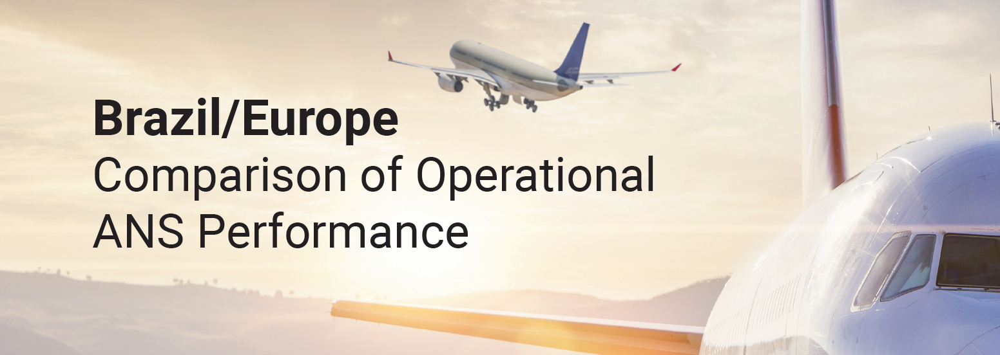
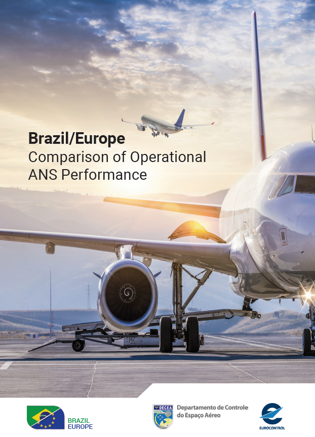

--- 
title: "Comparison of Operational Air Navigation System Performance in Brazil and Europe"
author: "Performance Section (DECEA) and Performance Review Unit (EUROCONTROL)"
date: "`r format(Sys.Date(),'%d %B %Y')`"
site: bookdown::bookdown_site
output: bookdown::gitbook
documentclass: book
bibliography: [book.bib, packages.bib, Brazil-Europe-Comparison-xbib.bib]
biblio-style: apalike
link-citations: yes
github-repo: euctrl-pru/international-BRA-EUR
description: "This initial comparison of Operational Air Navigation System Performance in Brazil and Europe is a jointly developed report. It comprises two parts: Part A provides the most recent traffic/demand related system characterisation in light of COVID19; Part B represents the initial comparison report based on a selected subset of measures. The regional comparison will be updated on a regular basis."
---

```{r include=FALSE}
# automatically create a bib database for R packages
knitr::write_bib(c(
  .packages(), 'bookdown', 'knitr', 'rmarkdown'
), 'packages.bib')
# set knitroptions
knitr::opts_chunk$set(echo = FALSE, message = FALSE, warning = FALSE)
```

# Welcome {-}

<!-- banner for top of the page ------------------------------------------  
bookdown formt strips off js before first heading! -----------------------   -->
```{js, echo = FALSE}
title=document.getElementById('header');
title.innerHTML = '' + title.innerHTML
```


This online version presents the initial comparison of Operational Air Navigation System Performance in Brazil and Europe.

It is organised in 2 parts:

* **Part A - COVID-Briefing**: most recent COVID19 related system characteristics in terms of traffic/demand. This part will be updated on a regular basis.

<div style="float:right; padding:10px; height:150px; width:100px">
<a href="figures/x-cover-bra-eur-2019.png" download>download the report
```{r cover2019, echo=FALSE}

```
</a>
</div>

* **Part B - initial comparison report**: The initial comparison report describes the operational performance in Brazil and Europe for the years 2016-2019. It is based on a selected subset of the ICAO GANP key performance indicators. It is planned that the rolling update of Part A will successively develop into the next iteration of the comparison report.

Previous reports will be available via this page for download.

For any questions, please do not hesitate to contact one of the authoring organisations.
Enjoy the read!

*Performance Section, DECEA*    
*Performance Review Unit, EUROCONTROL*

